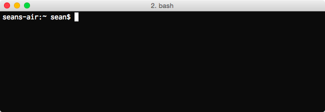

# Using the Command Line

## Preparing your Computer
Let's see how we can open up a command line in Windows, Mac and Linux.

### Mac & Ubuntu Users
If you’re using a Mac or you’re using the Ubuntu operating system find a program called **Terminal** and open it. Here's what the icon looks like on a Mac:

### Windows

If you're using a Windows PC, [download and install Git for Windows](https://git-scm.com/download/win). Once you've installed the software, find a program called **Git Bash** and open it. Git Bash uses emulation to provide commands that behave like a Unix environment.

Another way to get a UNIX environment in Windows is to use the new Windows Subsystem for Linux (only available for Windows 10). There's a good set of instructions [here](https://www.howtogeek.com/249966/how-to-install-and-use-the-linux-bash-shell-on-windows-10/), though I recommend you start off with **Git Bash** as it's easier to get started with.

## Opening the Terminal
Once you have opened up Terminal then you should see a window that looks something like this:

What you are looking at is the bash shell! Your shell will surely look different than mine, but all bash shells have the same essential parts.

As you can see in my shell it says `seans-air:~ sean$`. This string of characters is called the prompt. You type command line commands after the prompt. 

The prompt is just there to let you know that the shell is ready for you to type in a command. Press `Enter` on your keyboard a few times to see what happens with the prompt.

Your shell should now look like this:

If you don’t type anything after the prompt and you press `Enter` then nothing happens and you get a new prompt under the old prompt. The white rectangle after the prompt is just a cursor that allows you to edit what you have typed into the shell. Your cursor might look like a rectangle, a line, or an underscore, but all cursors behave the same way. After typing something into the command line you can move the cursor back and forth with the left and right arrow keys, just like 
you would when typing an email.

Now that we have pressed `Enter` several times our shell looks messy with all of those old prompts! Type `clear` at the prompt and then hit `Enter`. Voila! Your shell now only has the current prompt, just like when you first opened the terminal.

Try running the `echo 'Hello World!'` command.

If you want to see the last command press the `Up` arrow key. You can press `Up` and `Down` in order to scroll through the history of commands that you’ve entered. If you want to re-execute a past command, you can scroll to that command then press `Enter`. Try getting back to the `echo 'Hello World!'` command and execute it again.

You're now ready to complete the exercises!

## License
Content based on [The Unix Workbenck](https://seankross.com/the-unix-workbench/) by Sean Kross is used under its [CC0 license](https://creativecommons.org/publicdomain/zero/1.0/).