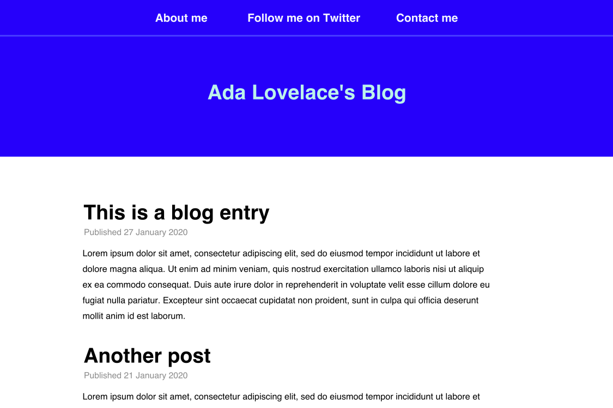

# Blog It! (assignment)

## Introduction
What better way to share everything you've learned about { insert your favorite topic here }, than a blog?

A blog is a collection of online articles that **you write**!

There's a whole lot of blogs on the internet from [cooking](https://pinchofyum.com/) and [technology](https://techcrunch.com/) to [logos](https://www.underconsideration.com/brandnew/).

## Requirements
Before you even start coding your blog, get out a piece of paper and **draw out your design**. Think about where you would like to use padding, margin and borders and the elements you would use.

Try to keep your design simple, with a one-column layout. To get your creative juices flowing, I've designed this blog:



At a minimum, your blog should have:

- Multiple pages
- At least two blog posts
- A `header` with links to other pages
- A correct HTML template (see below)

Here's a template you can copy and paste to get started:
```html
<!DOCTYPE html>
<html>

<head>
    <title>My blog</title>
</head>

<body>

</body>

</html>
```

**Hint**: This is a fairly large assignment! Break the assignment into small chunks. First create the links in the header, then the header, then the blog posts!

Have fun!

## Solution
There are **many** (some would say infinite) possibilities for this assignment!

You can download my solution and have a look around by downloading [https://github.com/projectmaterial/css-blog-it/archive/master.zip](https://github.com/projectmaterial/css-blog-it/archive/master.zip).