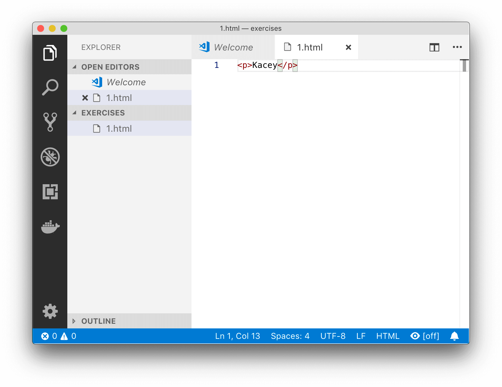

# Exercises

## Welcome
Welcome to your first **exercise pack**.

I've made some mini HTML exercises that you should **complete right after each chapter in the app**!

Try to complete each exercise **without** the answer.

## Your name
Create a HTML website that just has your name in a `p` element.

Verify the HTML is working by opening your page in a browser.

## Your name (solution)
Here's how I'd solve this problem. Since it's the first exercise, I've included more detail than normal.

Be sure to read through the Getting Started guide if you haven't already.

### Step 1: Create a folder
I've created a folder called `exercises` somewhere on my computer.

I'll use the folder for all the exercises in this pack.

### Step 2: Getting VS Code ready
Open the `exercises` folder in **VS Code**, then make a new file called `your-name.html` (any name will do!).

### Step 3: Coding!
We saw how to use the `p` element, by creating the opening and closing tags, then putting the **text** (i.e. your name) between the tags.

For example, I would use:

```html
<p>Kacey</p>
```

### Step 4: Save!
I save my changes in VS Code after every change to make sure I don't lose anything. Here's what my VS Code looked like after I was done coding;



### Step 5: Open in a browser
It's important to verify everything's working. I've opened `your-name.html` in my browser to test the website looks right.

## About me
Create a HTML website with a short description of yourself.

**Hint**: You can use multiple `p` elements!

## About me (solution)
I'll make a new file in my `exercises` folder for this exercise and call it `about-me.html`.

As the hint states, we can use `p` multiple times to create multiple paragraphs of text.

In `about-me.html`, I've written a short description of me with HTML:

```html
<p>My name is Kacey, and I like coding in HTML</p>

<p>The reason I like HTML is because you can have multiple paragraphs of text!</p>
```

## About me with heading
Create another copy of the HTML website with a short description of yourself.

Now, add a **major** heading that says *About me*.

## About me with heading (solution)
You can use `h1` for the key heading on the page.

I've added a `h1` element:

```html
<h1>About me</h1>

<p>My name is Kacey, and I like coding in HTML</p>

<p>The reason I like HTML is because you can have multiple paragraphs of text!</p>
```

## Good food
Here is a list of two foods:

```html
<ul>
    <li>kiwi fruit</li>
    <li>grilled corn</li>
</ul>
```

Add your favorite food to this list.

## Good food (solution)

I've added another list item:

```html
<ul>
    <li>kiwi fruit</li>
    <li>grilled corn</li>
    <li>cherries</li>
</ul>
```

## Good music
Create a list with your top three favorite albums/movies ever.

## Good music (solution)
This list is ordered, so you'll want `ol`.

```html
<ol>
    <li>Jingle Code</li>
    <li>Rocking with HTML</li>
    <li>Coding all the Way</li>
</ol>
```

## Cafe
A local cafe needs your help making a small website.

Here's the **main headings** they need:

* the cafe name, Cafe Cool, which is also the **title** of the website
* a menu
* opening hours
* address

The menu will need **subheadings** of:
* flat white coffees
* black coffees
* latte coffees

Create a HTML website with **only the headings**.

**Hint**: Think about whether each heading should be `h1`, `h2` or `h3`.

## Cafe (solution)
There is no single correct answer for this exercise.

The cafe name is the single most important thing, so we'll give it a `h1` element:

```html
<h1>Cafe Cool</h1>
```

The rest of the headings are all of lesser importance than the title, however they are still major subsections. I've used `h2` tags for them:

```html
<h2>Menu</h2>
<h2>Opening hours</h2>
<h2>Address</h2>
```

Additionally, the menu needs subheadings. They are subheadings of a `h2` element, so it makes sense to make them `h3` elements:

```html
<h2>Menu</h2>
<h3>flat white coffees</h3>
<h3>black coffees</h3>
<h3>latte coffees</h3>
```