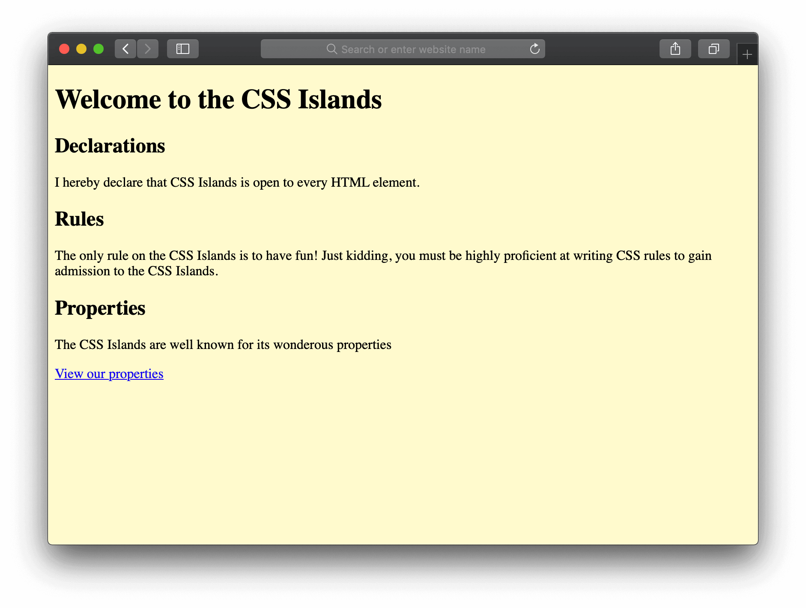

# Exercises

## Welcome
Welcome to your third **exercise pack**!

For this set of exercises you'll need this HTML in a file called `exercises.html`:

```html
<!DOCTYPE html>
<html>

<head>
    <title>CSS Islands</title>
    <link rel='stylesheet' href='styles.css' />
</head>

<body>
    <header>
        <h1>Welcome to the CSS Islands</h1>
        <p>A relaxing destination for everyone!</p>
    </header>

    <h2>Declarations</h2>
    <p>I hereby declare that CSS Islands is open to every HTML element.</p>

    <h2>Rules</h2>
    <p>The only rule on the CSS Islands is to have fun! Just kidding, you must be highly proficient at writing CSS
        rules to gain admission to the CSS Islands.</p>

    <h2>Properties</h2>
    <p>The CSS Islands are well known for its wonderous properties</p>
    <p><a href='https://www.w3.org/TR/CSS21/propidx.html'>View our properties</a></p>
</body>

</html>
```

Additionally, you'll need another **CSS file** called `styles.css`:

```css
body {
    background: lemonchiffon;
}
```

If you've correctly copied the code, when you open `exercises.html`, the webpage should look like this:



## Color the headings
The headings look very drab! 

Select the headings and give it a nice color.

**Hint**: Search online for a color picker to select a color!
**Hint**: Select the headings using `h2` then put the declaration for the `color` inside `{}`

## Color the headings (solution)
I used a bright red color for my headings:

 ```css
h1 {
    color: red;
}
```

## Getting professional
Use a `sans-serif` font family for all `p` elements.

## Getting professional (solution)
Use the `font-family` property:

```css
p {
    font-family: sans-serif;
}
```

## Blue
Make the `p` elements **inside** the `header` blue (the color of the `h1` inside `header` should **not** change).

## Blue (solution)

You can select elements inside other elements by combining the selectors with a space.

```css
header p {
    color: blue;
}
```

`header p`, gets all the `header` elements. Then from these elements we narrow down the selected elements to only the `p` elements.

## Bold
Center align the `p` inside the `header` and make its font weight be `bold`.

## Bold (solution)
Use `text-align` and `font-weight`:

```css
header p {
    text-align: center;
    font-weight: bold;
}
```

## Center alignment
Center align **all** headings.

**Hint**: Can you think of a way to reuse a single declaration?

## Center alignment (solution)
The most obvious solution is to select each heading element separately:

```css
h1 {
    text-align: center;
}

h2 {
    text-align: center;
}
```

However, since both rules are doing the same thing, we can combine them like this:

```css
h1, h2 {
    text-align: center;
}
```