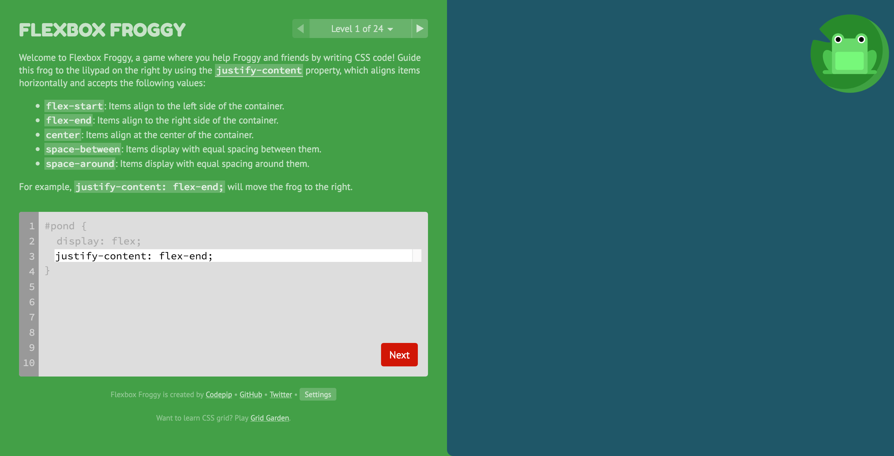

# Exercises

## Welcome
Welcome to your fifth (and final) **exercise pack**!

You'll need to download several files for this exercise pack from [https://github.com/projectmaterial/css-exercises-5/archive/master.zip](https://github.com/projectmaterial/css-exercises-5/archive/master.zip).

## Newsletter IDs
A club of dragon spotters have a weekly newsletter that's in dire need of a new layout.

Open `newsletter.html` to:

1. Add an `id` of `sidebar` to the first `div`
2. Add an `id` of `updates` to the second `div`

## Newsletter IDs (solution)

Open `newsletter-with-id.html` to see the solution I made. Here's the important bits:

```html
<div id='sidebar'>
    
    <p>Artist impression of a dragon that looks like an iguana.</p>
</div>

<div id='updates'>
    <p>Dragons were last spotted in the following cities:</p>
    <ul>
        <li>London: dragon spotted flying around the Big Ben</li>
        <li>New York: dragon seen climbing the Empire State Building like King Kong</li>
        <li>Sydney: dragon seen performing dramatic work at the Sydney Opera House</li>
    </ul>
</div>
```

## Newsletter width
In `newsletter.css`:

1. Give `#sidebar` a width of `40%`
2. Give `#updates` a width of `60%`

## Newsletter width (solution)
```css
#sidebar {
    width: 40%;
}

#updates {
    width: 60%;
}
```

## Newsletter float
Use `float` so `#sidebar` is on the left and `#updates` is on the right

## Newsletter float (solution)
Add this CSS to your previous answer:

```css
#sidebar {
    float: left;
}

#updates {
    float: right;
}
```

## Newsletter clear
Use CSS so the `footer` doesn't crawl up into the webpage

## Newsletter clear (solution)
Create a `clear` declaration like this: `clear: both`. Add this CSS to your previous answer:

```css
footer {
    clear: both;
}
```

## Flexbox Froggy (optional)



Go to [https://flexboxfroggy.com/](https://flexboxfroggy.com/) and play Flexbox Froggy!