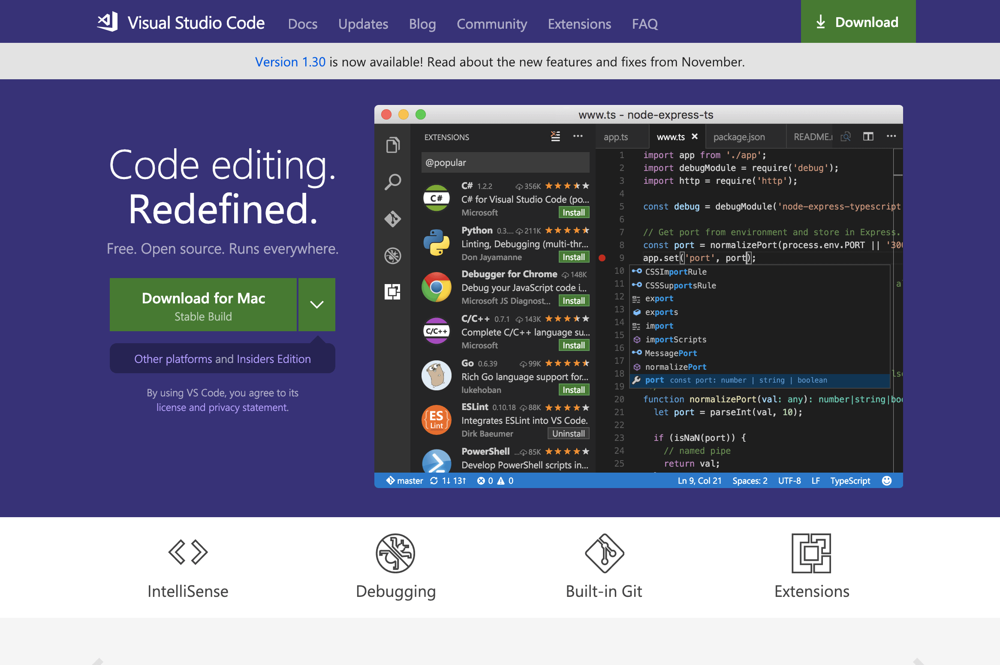
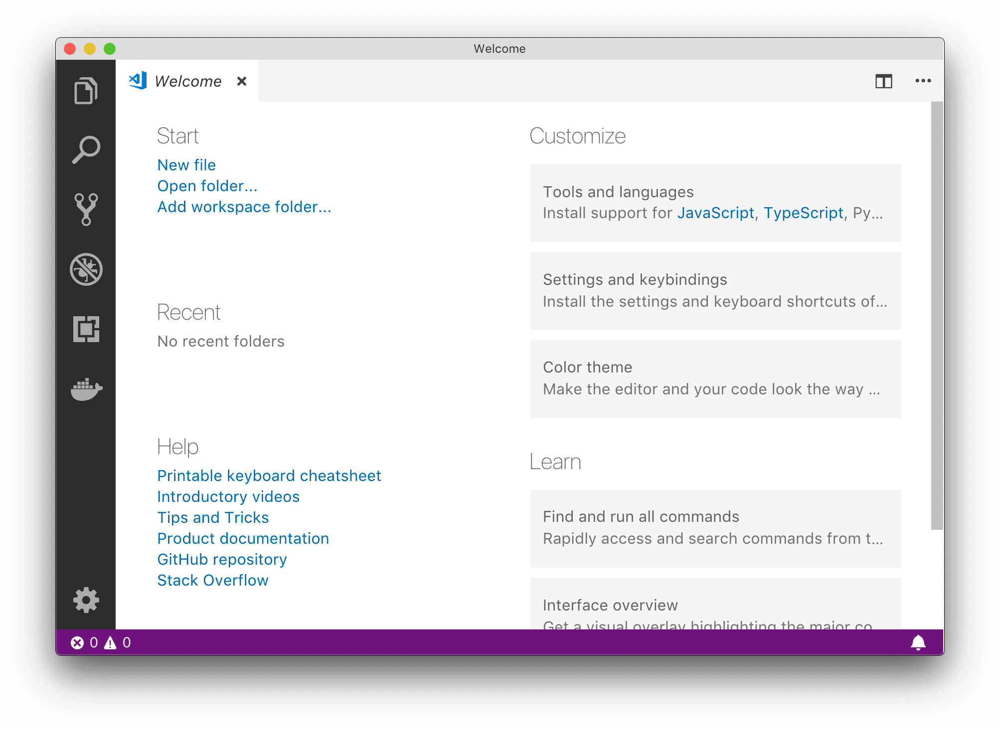
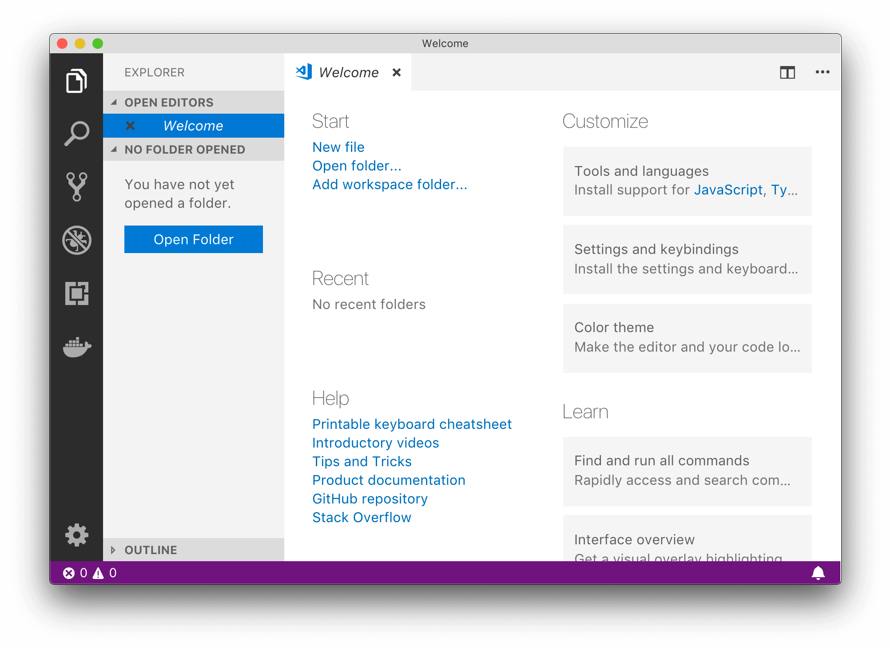
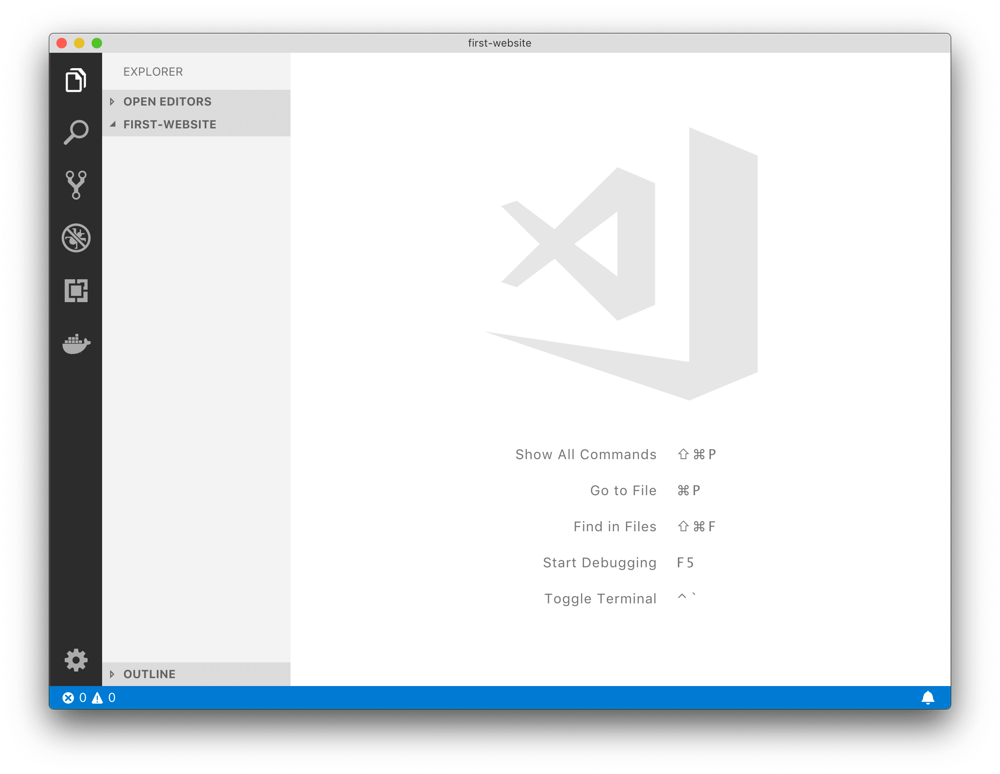
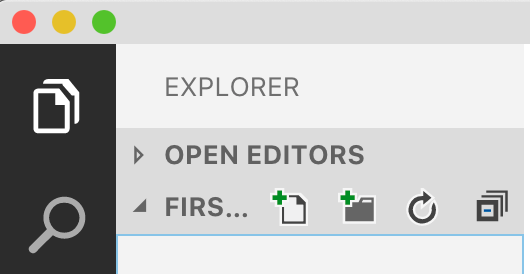
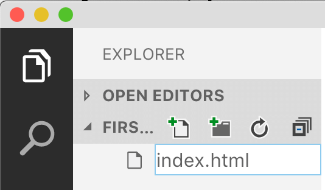
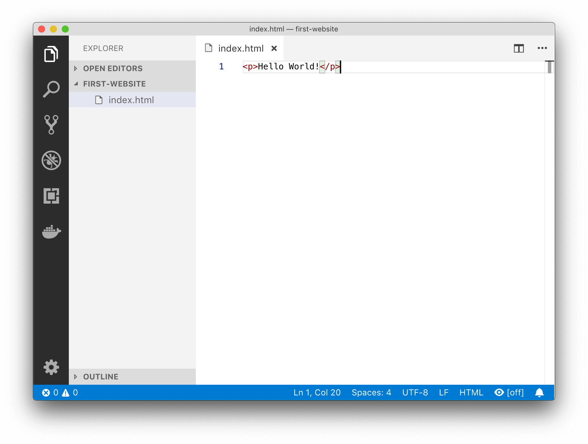
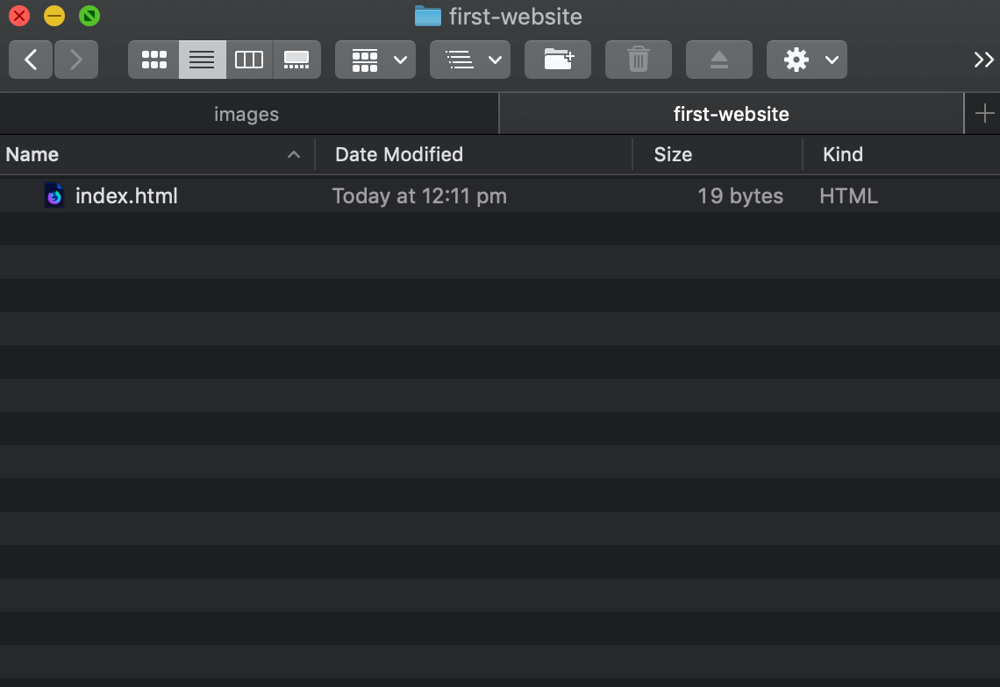
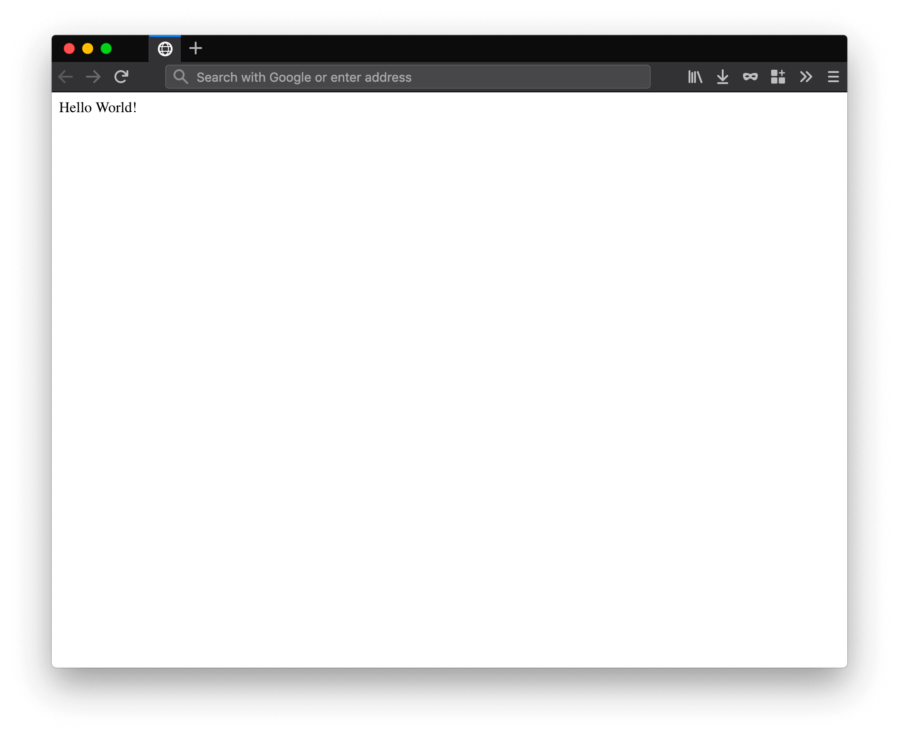
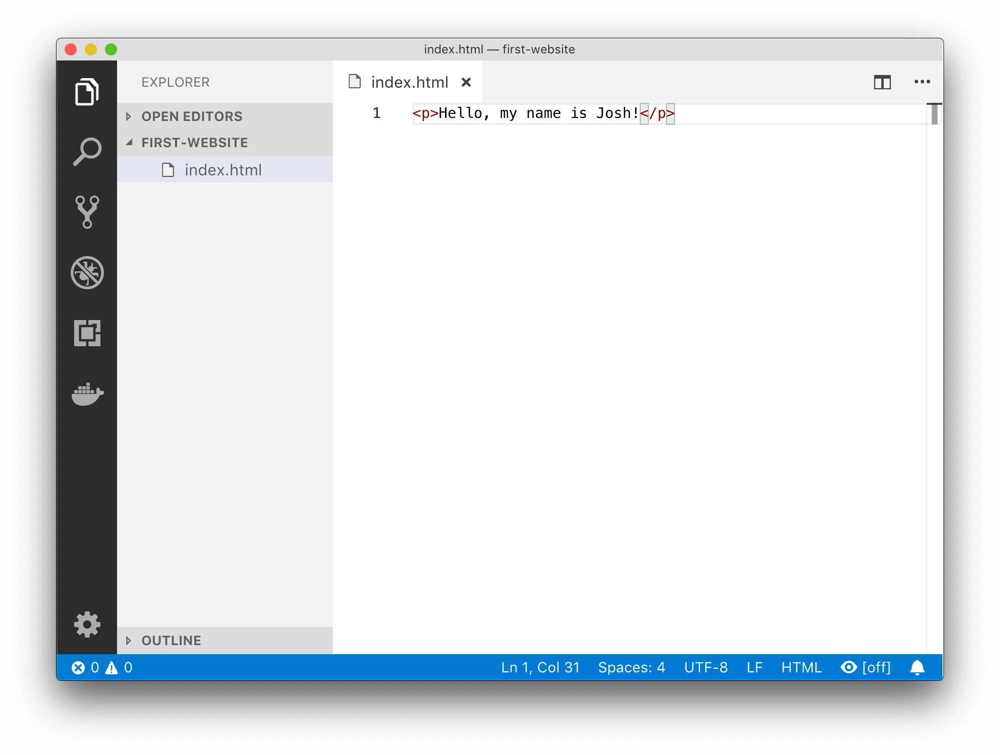

# Getting Started

## Goals
In this guide, we'll get your computer set up to make websites! You will:

1. Install a text editor
2. Create a folder to store all your websites
3. Create your first webpage

## Setting up your computer
When making websites, you'll want **one folder** per **website**!

Create a folder somewhere on your computer called `first-website`.

We'll need this folder later!

## Text editor
Let's install a powerful text editor that provides a nice environment for creating HTML websites.

Head over to the Visual Studio Code (VS Code) website, then download and install VS Code.



Once you've installed VS Code, open it up! It will look something like this:




## Opening workspaces and making files
In **VS Code**, you can **open a folder** as a workspace. This is handy as it lets you make folders and files from VS Code!

To open a folder in VS Code, click on the **Explorer** icon (the first icon in the sidebar): 



You'll notice there's a bit of text saying that you have no folder opened.

Now click on **Open Folder** and select your `first-website` folder. This is what **VS Code** looks like (notice the folder name is now in the title bar and explorer pane):



Now that we've opened a folder as a workspace we can make new files!

Hover over the folder name and a toolbar will appear allowing you to manage your folder from right inside VS Code:



Then click the new file icon and make a file called `index.html`:



## Making our first website
Open `index.html` and **write some HTML code**:

```html
<p>Hello World!</p>
```

This is what your editor should look like:



Now **save** your code (Ctrl + S on Windows or Command + S on macOS)!

## Opening website
Now that we've made our HTML webpage, we can open it up! 

In Windows Explorer or Mac's Finder, open up the `first-website` folder and verify your new `index.html` file is there: 



Double click the `index.html` file to open it in a **web browser**! I'm using Mozilla Firefox, and here's what the website looks like:



Keep your web browser open (it will come in handy soon!).

## Making changes
Let's try to **change** our code a bit.

In `index.html`, change the code so it says your name like this:

```html
<p>Hello, my name is Josh!</p>
```

This is what VS Code should look like:



**Save your changes**, and go back to the **web browser** that you opened your website previously in.


Hit **refresh** (*F5* in Chrome and Firefox, and *Ctrl + R* in Safari) in the browser and you should see your changes!

## What you've learned
In this guide you've seen how to write and change HTML code in VS Code, then see the resulting website in the web browser.