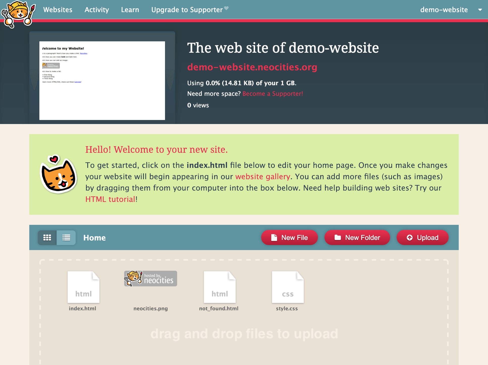

# Publishing a Website

## Introduction
In this last guide **you** get to decide what you want to share with the world.

Here are some ideas to get the ball rolling:

- A website for a small business you love (ask for permission first!)
- A website about your hobby
- A personal website
- A website for recipes
- A blog!

After you've built something you're happy to share with the world, go forth and learn how to publish it online!

## Publishing with Neocities
Woo-hoo! I'm assuming you've made an awesome ready for sharing with the world!

Before we get started, make sure your homepage is in a HTML file called `index.html` and **not** `home.html` (anything else!).

### Step 1: Visit Neocities

Neocities is a free (and [open-source](https://github.com/neocities/neocities)) website that **hosts** websites.

Sign up for an account and choose a good **username** (your website will be available at *username.neocities.org*).

### Step 2: Select a plan

Go ahead and select a **free plan** for now.

### Step 3: Go to the dashboard

You might see this intro page, since you already know HTML, click on *Go to the dashboard >>*.

### Step 4: Upload your website

Click on the read *Upload* button and select **all the files** in your website folder.

### Step 5: View your website!
Visit your website's URL which is shown at the top of the page.

For example, mine's at *demo-website.neocities.org*.

When you visit your URL, the `index.html` will be displayed!

## More options
There's heaps of other hosts to put the websites you've created online!

Khan Academy has a great tutorial for [hosting your website on GitHub](https://www.khanacademy.org/computing/computer-programming/html-css/web-development-tools/a/hosting-your-website-on-github).

If you're familiar with the command line (check out our Command Line skill!), you might like to use [Surge](https://surge.sh/) or [Firebase Hosting](https://firebase.google.com/docs/hosting) from Google, which let you put websites online right home from your command line!

## Done!
Great job making and publishing a website on the WWW!