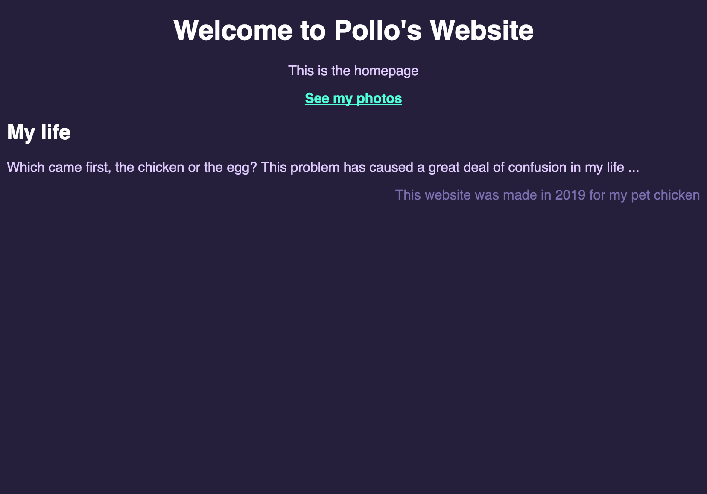
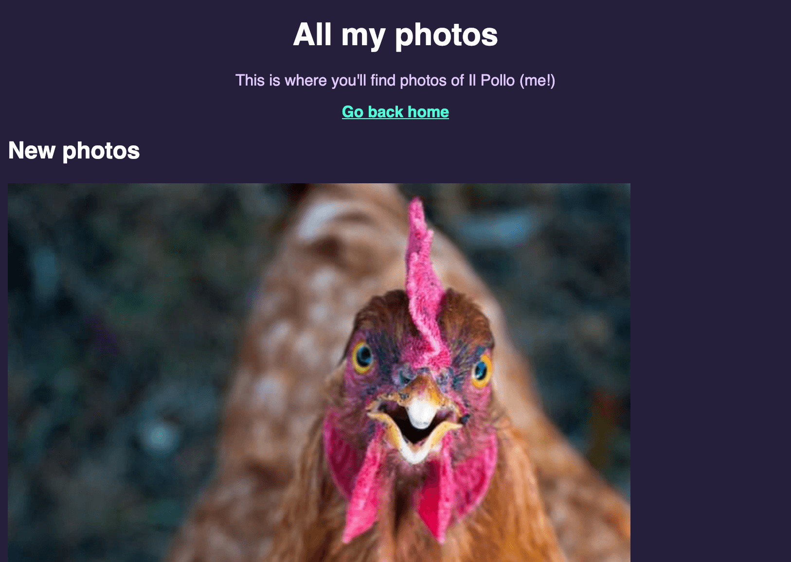

# Your Website, Styled (assignment)

## Introduction
It's time to make your website from the previous assignment beautiful!

## Requirements
At a **minimum**, your styled website should have:

- A CSS file with your website's styles linked with `<link rel='stylesheet' href='styles.css' />` in your HTML (replace `styles.css` with your CSS file's name)
- More than one color on a HTML element
- Headings that have some text styling (e.g. a different font family, or aligned to the center)

## Solution
I made my website about my hypothetical pet chicken (Pollo) stylish with CSS!

Here's the final design:




To make this solution, I created a shared stylesheet called `styles.css`, then I changed the HTML to link to the CSS file like this (an excerpt from my `index.html` file):

```html
<head>
    <title>Home</title>

    <link rel='stylesheet' href='styles.css' />
</head>
```

Here's the styles I used in `styles.css`:

```css
body {
    font-family: sans-serif;
    background: #251f3c;
    color: #a2ffe0;
}

header {
    text-align: center;
}

header, h1, h2 {
    color: white;
}

a {
    color: #51ffd8;
    font-weight: bold;
}

p {
    color: #e2ccff;
}

footer p {
    color: #7c6faf;
    text-align: right;
}
```

It's a good idea to play around with the different designs possible with what you've made so far!