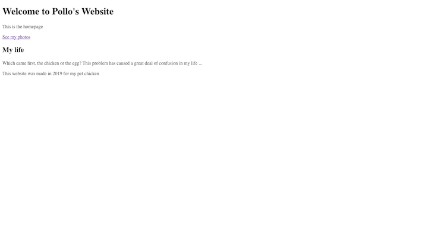
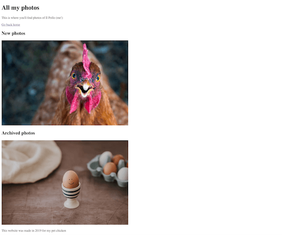

# Your Website (assignment)

## Introduction
Let's spend some time making a website about ourselves (or a friend or celebrity, if you can't stand writing about yourself)!

## Requirements
At a minimum, your website should have:

- More than one page linked together (e.g. an about page, a contact page and a photos page)
- At least one image with your favorite thing to do (visit [Unsplash](https://unsplash.com) for free images if you don't have any)
- Headings on each page
- A `header` and `footer`
- A correct HTML template (see below)

**Keep your solution to this assignment somewhere safe as you'll build upon it in the next assignment.**

Here's a template you can copy and paste to get started:
```html
<!DOCTYPE html>
<html>

<head>
    <title>My website</title>
</head>

<body>

</body>

</html>
```

## Solution
I made a website about my hypothetical pet chicken (Pollo).

There are just two pages: `index.html` and `photos.html`.



This is my `index.html` code:

```html
<!DOCTYPE html>
<html>

<head>
    <title>Home</title>
</head>

<body>
    <header>
        <h1>Welcome to Pollo's Website</h1>
        <p>This is the homepage</p>
        <a href='photos.html'>See my photos</a>
    </header>

    <h2>My life</h2>
    <p>Which came first, the chicken or the egg? This problem has caused a great deal of confusion in my life ...</p>

    <footer>
        <p>This website was made in 2019 for my pet chicken</p>
    </footer>
</body>

</html>
```



This is my `photos.html` code (which has some images from the web saved to my computer):

```html
<!DOCTYPE html>
<html>

<head>
    <title>Photos</title>
</head>

<body>
    <header>
        <h1>All my photos</h1>
        <p>This is where you'll find photos of Il Pollo (me!)</p>

        <a href='index.html'>Go back home</a>
    </header>

    <h2>New photos</h2>
    

    <h2>Archived photos</h2>
    

    <footer>
        <p>This website was made in 2019 for my pet chicken</p>
    </footer>
</body>

</html>
```