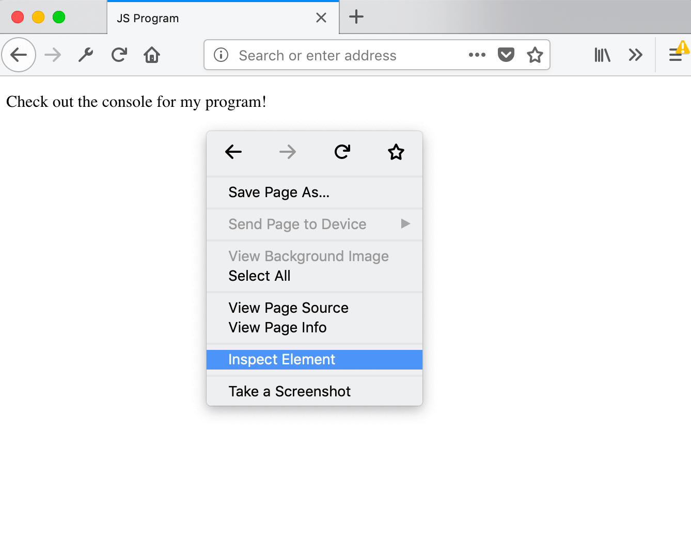
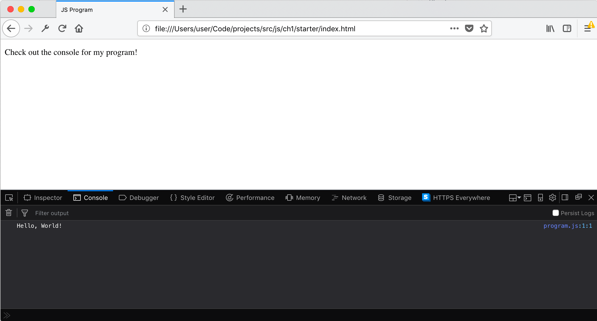
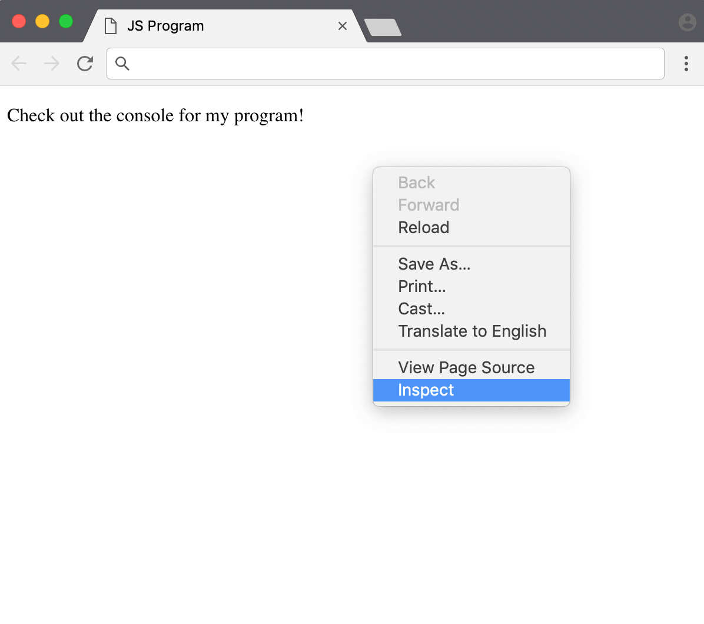
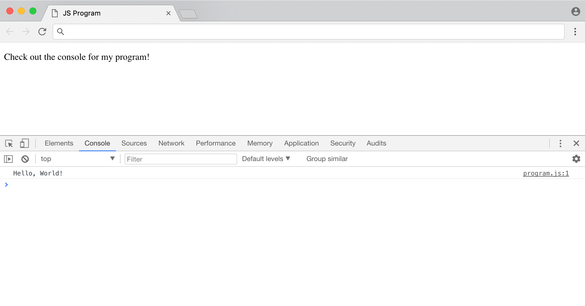
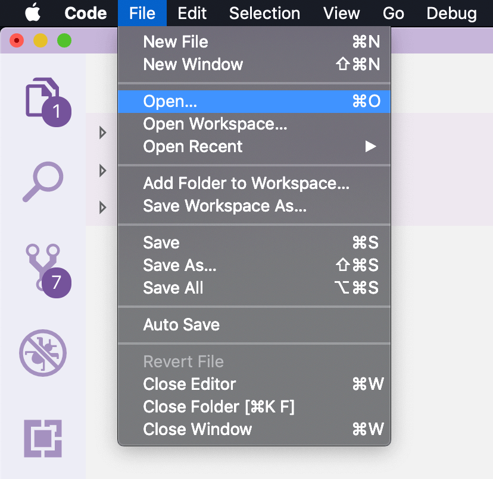
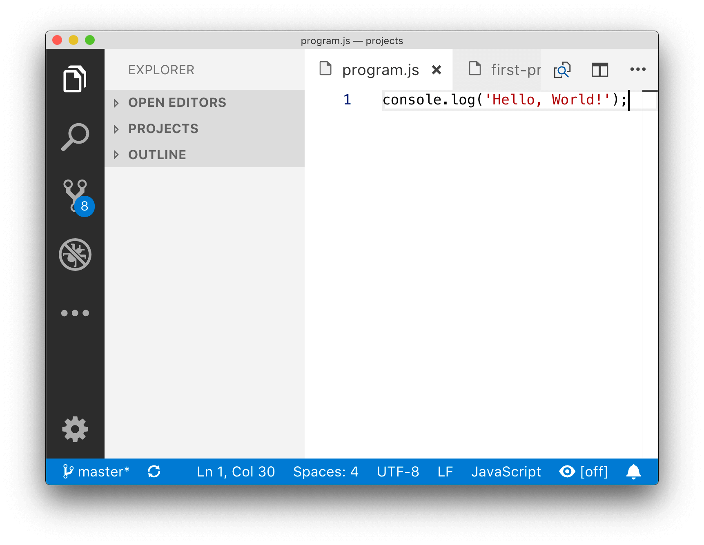
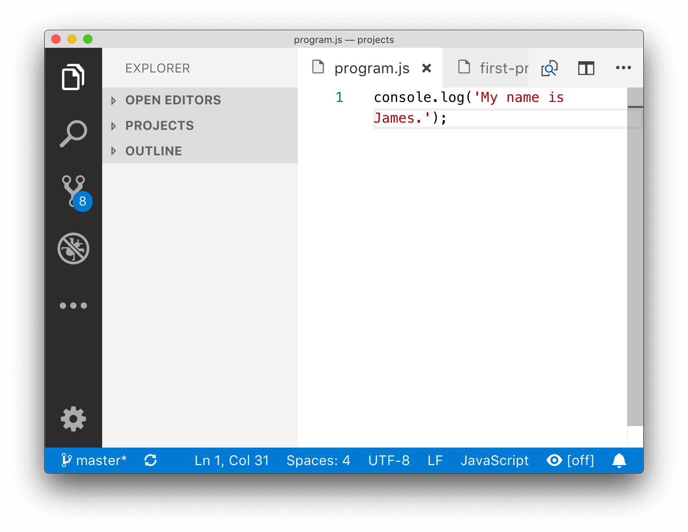
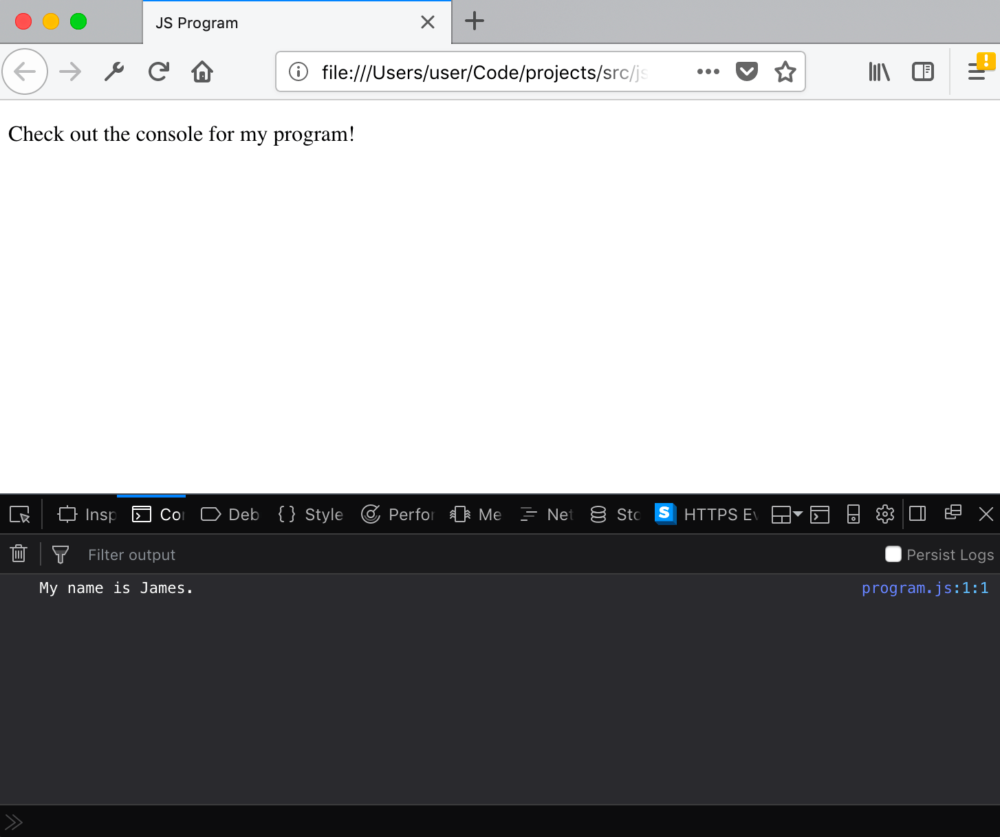

# Your First Project

## Goals
Let's get our computer set up so we can run the **'Hello, World!'** program.

We'll need to do three things:

1. Download the template
2. Install a web browser
3. Install a text editor

## Where does JS run?
As we very briefly touched on how **JS** can be run in many places, from a **web browser** to a **web server**!

Since everyone already has a **web browser** (like Firefox or Google Chrome) installed, we'll use **JS** on the web browser in our projects.

## The HTML template
**HTML** is a language that lets you build websites, so we've prepared a **HTML** file that only does one thing: loads a **JS file** into a webpage.

The **details** of the HTML are not important, as we're learning **JS**. However, if you're interested, we've created **HTML** lessons in the **Create a Website** skill.

## Using the template
Download the template files from [https://github.com/projectmaterial/js-template/archive/master.zip](https://github.com/projectmaterial/js-template/archive/master.zip) and **unzip** the contents.

You should see two files:
- `index.html`
- `program.js`

The `index.html` is the file you open in your browser (a **HTML** file) and `program.js` (a **JavaScript** file) is where you write your programs in JS!

## Installing a web browser
The instructions in our projects are prepared for the **latest versions** of two popular browsers: [Firefox](https://www.mozilla.org/en-US/firefox/developer/) and [Google Chrome](https://www.google.com/chrome/).

If you don't already have either browser, please install one of them!

## Opening `index.html`
Try opening `index.html` in your web browser by double clicking on it.

You see a page that says "Check out the console for my program!".

## Checking the console

Make sure you have `index.html` opened in your browser. Let's check out the message in the console.

### Firefox
In Firefox, you can open the **console** by right clicking the page and then clicking on **Inspect Element**.

Now click on **console** and you should see a message!

### Google Chrome
In Chrome, you can open the **console** by right clicking the page and then clicking on **Inspect**.

Now click on **console** and you should see a message!

## Installing a editor
Ok, it's time to install a **text editor** that can be used to write our JS code!

Install **VS Code** from [code.visualstudio.com](https://code.visualstudio.com/).

## Editing a file
Now that **VS Code** is installed, open it up.

Let's try changing our `program.js` file in the editor.

Click on *File > Open* and navigate to the `program.js` file. The editor now looks like this:

Now, let's change the text **inside** the quote marks to say 'My name is James.' (of course, replace *James* with your name!). Your editor now looks like this:

Hit *Ctrl-S* to save (on Windows) or *Command-S* (on macOS) to save the file.

## Viewing modifications
Ok, so we just **modified** and **saved** our JS program in **VS Code**.

Hit refresh in the browser and check the console (using the same steps as before!).

You should see **your name**!

If you see any errors, carefully check that your JS code matches ours. Every character matters in code!