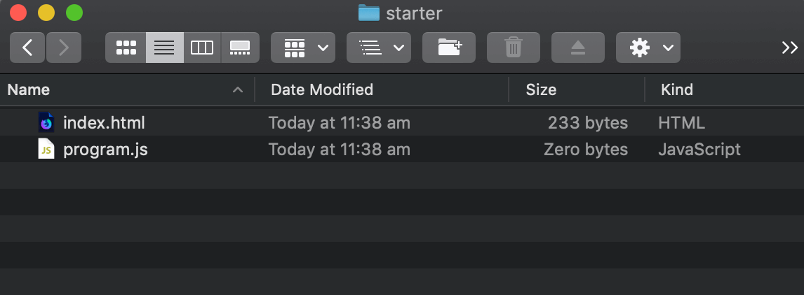
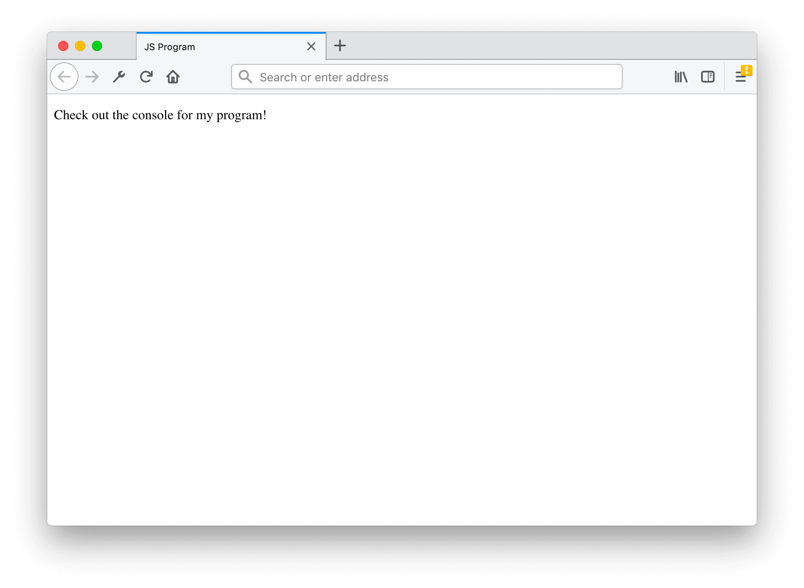
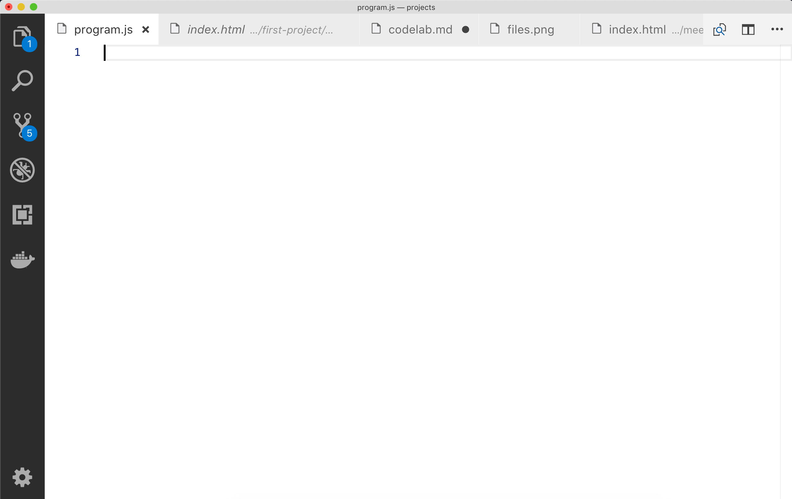
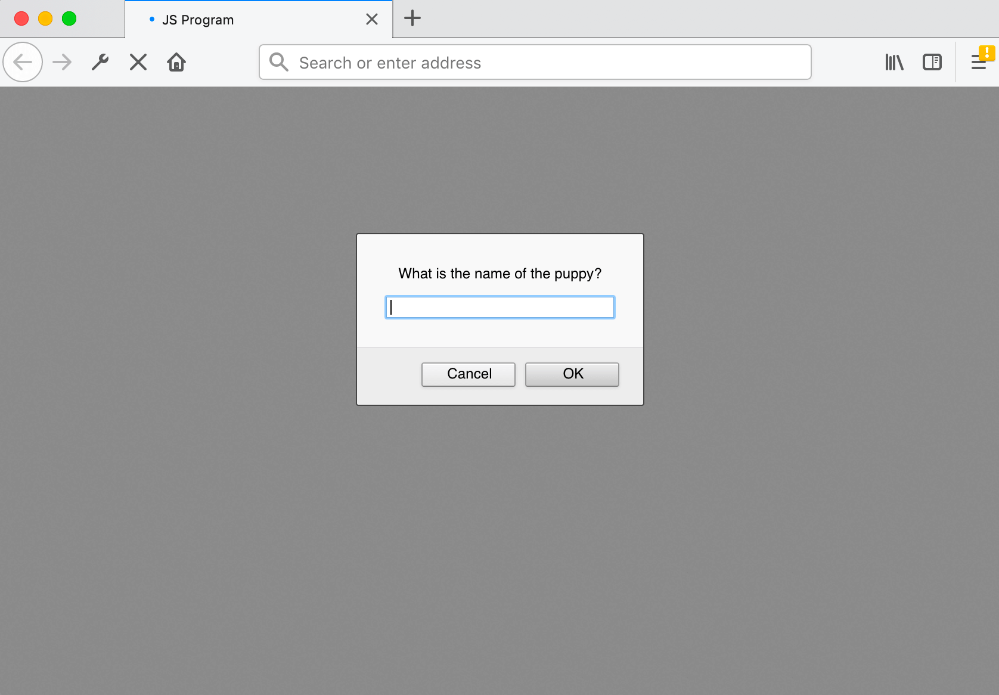
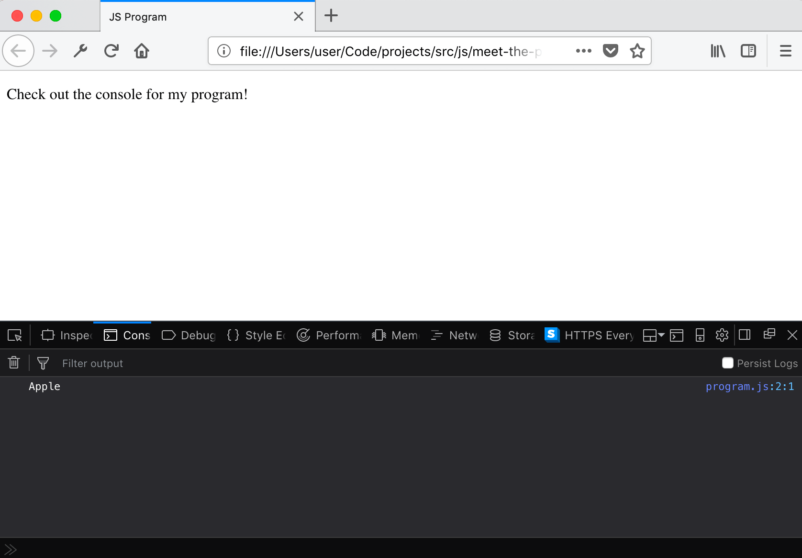
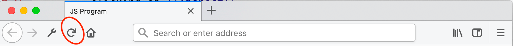

# Meet the Puppy

## Background
Your friend has a new puppy! Write a program to tell the puppy to sit using its name.

```text
What is the name of the puppy? Fluffy
Sit Fluffy
```

Your program should work with any puppy name:

```text
What is the name of the puppy? Shadow
Sit Shadow
```

## Getting started
As this is your **first** real project, we'll walk though each step required.

## Download template
First, download and **unzip** the template (it's always available for download at [https://github.com/projectmaterial/js-template/archive/master.zip](https://github.com/projectmaterial/js-template/archive/master.zip) if you don't already have a copy).

You should now have **two** files:



Now, open up **index.html** in your **browser**, and **program.js** in **VS Code**.




## Writing the program
Ok, we're ready to make this program!

Let's **learn how to make a prompt**!

## Prompting
The sample output of the program is this:

```text
What is the name of the puppy? Fluffy
Sit Fluffy
```

We need to ask the user **What is the name of the puppy?**.

In **JS** we can open a prompt box using `prompt()`. Try deleting all existing code, then writing this code out in **VS Code**:

```javascript
const puppyName = prompt('What is the name of the puppy?');
```

## Prompt in browser
Let's save our code with:
```javascript
const puppyName = prompt('What is the name of the puppy?');
```

Now, refresh the browser and you'll get this prompt:


Once you enter a name, the text is stored as a string inside `puppyName`.

## Logging the name
Let's print out the name in the **console** using `console.log`:

```javascript
const puppyName = prompt('What is the name of the puppy?');
console.log(puppyName);
```

**Save** your code and **refresh** your browser.

## Checking the logs
```javascript
const puppyName = prompt('What is the name of the puppy?');
console.log(puppyName);
```
Do you remember how to check the console?



### Firefox
In Firefox, you can open the **console** by right clicking and then clicking on **Inspect Element**.

Now click on **console** and you should see a message!

### Google Chrome
In Chrome, you can open the **console** by right clicking and then clicking on **Inspect**.

Now click on **console** and you should see a message!

## Your turn
```javascript
const puppyName = prompt('What is the name of the puppy?');
console.log(puppyName);
```

Ok, it's your turn now! Edit the program in `program.js` so we get the required output:

```text
What is the name of the puppy? Shadow
Sit Shadow
```

**Pro tip**: Tap **F5** on your keyboard to quickly refresh a page, or press the **refresh icon** in toolbar:



## Solution
This is the main solution I came up with:

```javascript
const puppyName = prompt('What is the name of the puppy?');
console.log(`Sit ${puppyName}`);
```

Here's other possible solutions:

```javascript
const puppyName = prompt('What is the name of the puppy?');
console.log('Sit ' + puppyName);
```

```javascript
const puppyName = prompt('What is the name of the puppy?');
const command = 'Sit';
console.log(command + ' ' + puppyName);
```

Great job!

## Additional content licenses
Questions are based on content from ACA, used under the following license:

*Copyright Australian Government Department of Education and Training 2017 to present, unless otherwise indicated. This material was downloaded from the Australian Computing Academy website (https://aca.edu.au) on 12 December 2018 and was modified. The material is licensed under CC BY 4.0. The Australian Government Department of Education and Training, University or Academy do not endorse any product or service that uses this material, make any representations as to the quality of such products or services, or is affiliated with or sponsors the provider.*