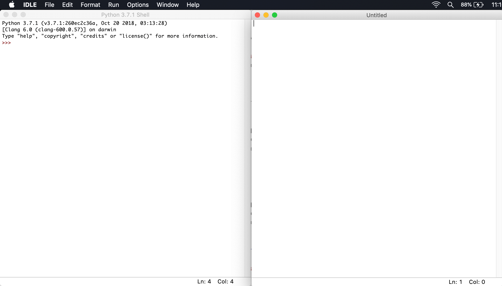
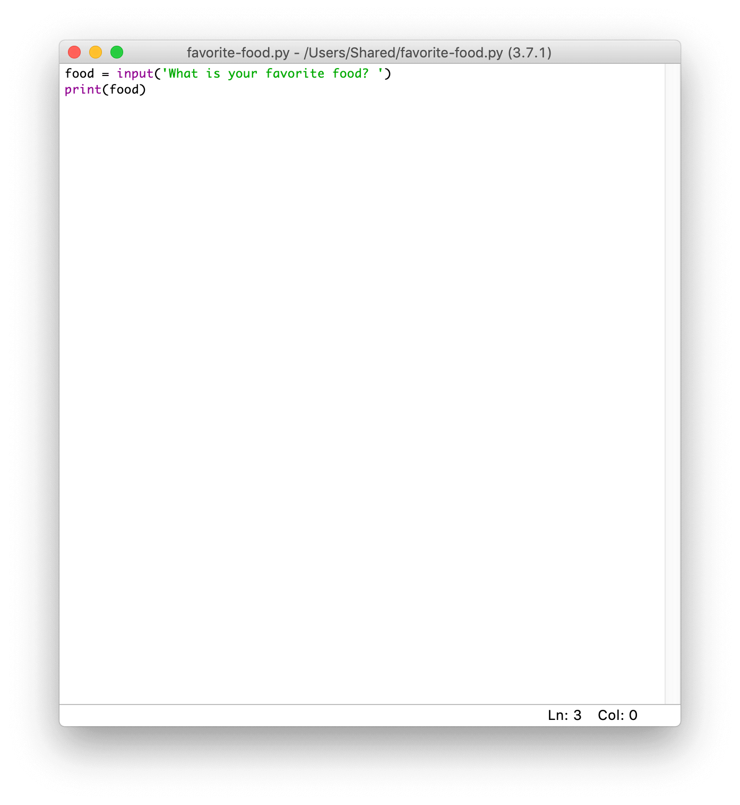
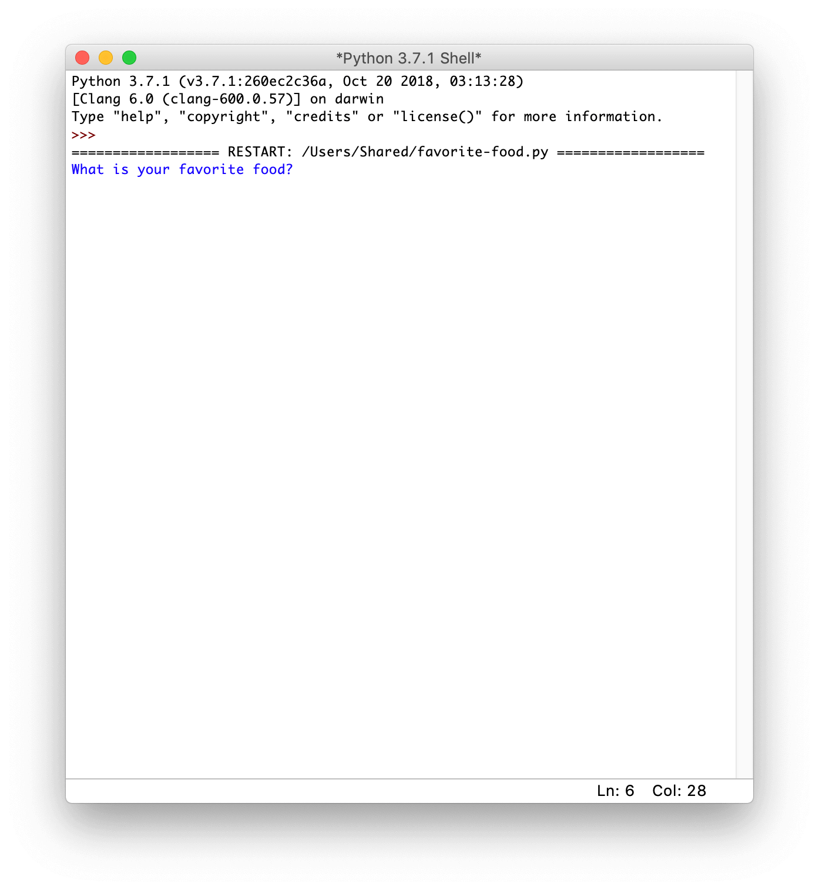
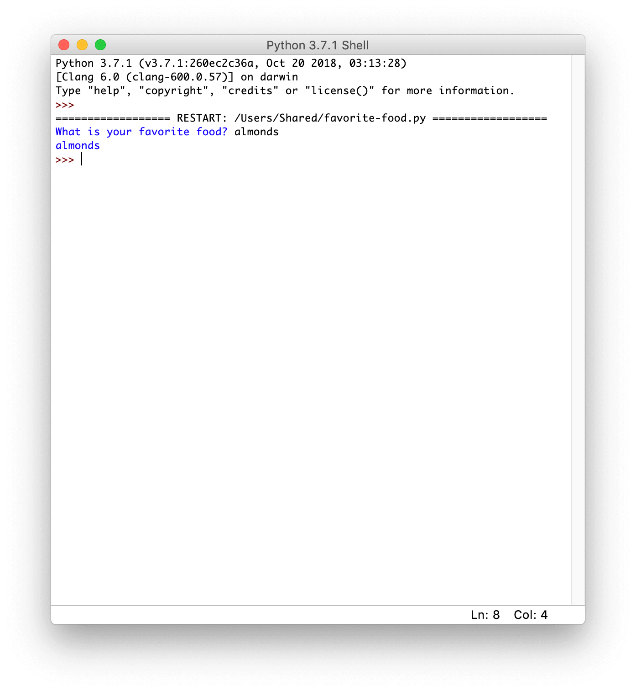

# Exercises

## Welcome
Welcome to your first **exercise pack**.

Exercises are short Python coding challenges that you should **complete right after each chapter in the app**!

Try to complete each challenge **without** the answer.

If you use the answer, come back to the challenge at a later time and try to complete is again **without** the answer!

We'll walk through the first exercise together so you know how to complete them!

## Favorite food
Ask the user for their favorite food, then print the food.

The program output should look like this:

```text
What is your favorite food? pears
pears
```

## Favorite food (walkthrough)

### Creating a new file
First, open up **Python IDLE** and create a new file using *File > New File*.

Your **editor** (right) and **shell** (left) will look something like this:


Whenever we create a new file, **save it**! Make sure you're on the editor then click on *File > Save as*. I've saved my file as `favorite-food.py`.

### Asking the user
The instructions say to *ask the user for their favorite food*.

In Python, we can ask for input using `input`! Type this code into your **editor**:

```python
food = input('What is your favorite food? ')
```

Now `food` will have the favorite food from the user.

### Printing the favorite food
Now that `food` stores the favorite food, we can print it!

Write this code **below** your previous code in the **editor**:

```python
print(food)
```

### Completed code
In your **editor** you should have this code.



### Running the code
Now **save your code** (*Ctrl + S* on Windows or *Command + S* on macOS) and run your program!

To do so, click on *Run > Run module* from the **editor** window.

### Providing input
In the **shell** you'll see your program output:



Right now it's asking us *What is your favorite food?*. Type in your favorite food then press *Enter* on your keyboard.

Here's our final program output:



## Completed first exercise
Woo-hoo! You've completed your **first exercise** in Python.

You've also learned how to get input from the user using `input`.

You'll now complete the next challenges on your own using all the skills you've learned so far! **Best of luck** and **have fun**!

## Greet me
Let's create a program that says hello to us!

The program output should look like this:

```text
What is your name? Ellen
Hi Ellen!
```

**Hint**: Use `input` from the last exercise
**Hint**: Create a new file for every exercise

## Greet me (solution)
To complete this exercise, I first asked for a name from the user, then stored it in a `name` variable:

```python
name = input('What is your name? ')
```

Now I have to say hi! There's two ways we learned to do this.

I could use concatenation (using +) to **join** the **strings**:

```python
print('Hi ' + name + '!')
```

However, my favorite solution is to use a **formatted string** like this:

```python
print(f'Hi {name}!')
```

Try out both these approaches in your code!

Putting everything together, this is the solution I came up with:

```python
name = input('What is your name? ')
print(f'Hi {name}!')
```

## Superhero catchphrase
Every good superhero and has a **catchphrase**!

Write a Python program that gets a superhero name **and** their catchphrase then combines it into some super dialogue.

The program output should look like this:

```text
What is the superhero's name? Spidercode
What is their catchphrase? Ah! A bug is behind you
Spidercode says, 'Ah! A bug is behind you'.
```

Here's another example:

```text
What is the superhero's name? Pytho
What is their catchphrase? Get back, Pytho is here
Pytho says, 'Get back, Pytho is here'.
```

Try the program out with your favorite superhero!

**Hint**: Remember to use `"` (**double quotes**) to make a string when the string itself has a **single quote**, for example `"What is the superhero's name?"` instead of `'What is the superhero's name?'`.

## Superhero catchphrase (solution)
I'll need two **strings** from the user, so that tells me I'll need to use `input` twice in my Python program.

With this exercise I had to be very careful when making strings! I used the **double quotes** to make the strings whenever there was a single quote in the string.

```python
name = input("What is the superhero's name? ")
catchphrase = input('What is their catchphrase? ')
```

All right, now `name` and `catchphrase` have some input from the user.

Again, I could use concatenation (using +) to **join** the **strings**:

```python
print(name + ' says, ' + "'" + catchphrase + "'.")
```

As you can see this approach is kind of messy and hard to get right.

My favorite solution is to use a **formatted string**. Here's how I used them:

```python
print(f"{name} says, '{catchphrase}'.")
```

Try out both these approaches in your code!

## Next year
Next year, you'll be an year older! Write a program that asks for your age, then outputs the **next** year.

The program output should look like this:

```text
How old are you? 30
31
```

Your program **does not** have to work if the user inputs a *float* or *string*:

```text
How old are you? I don't tell people my age. Thank you very much.
Traceback (most recent call last):
  File "/next-year.py", line 2, in <module>
    REDACTED
ValueError: invalid literal for int() with base 10: "I don't tell people my age. Thank you very much."
```

**Hint**: `input` gives back a **string** but we need an `int`! Remember, you can convert a string to an `int` using `int()`, for example: `int('20')`.

## Next year (solution)
This is a classic case where I need to convert a string (from the user) into an integer!

Remember that strings are **not** the same as numbers, so if I don't convert the string from the user I'd end up with `'30' + 1` instead of `30 + 1`. Be sure to revise the lesson on *Numbers vs. strings* in the app.

I started the solution by asking the user the question as normal:
```python
age = input("How old are you? ")
```

Next, I **converted** the string into an integer so I could perform math operations, like addition, on it:

```python
age = int(age) + 1
```

Finally, we print out the updated age.
```python
print(age)
```

Putting everything together, I came up with this:

```python
age = input("How old are you? ")
age = int(age) + 1
print(age)
```

### Alternative solutions
Instead of **changing** the value of the `age` variable, a different correct solution would be to make **another** variable called `ageNextYear` like this:

```python
age = input("How old are you? ")
ageNextYear = int(age) + 1
print(ageNextYear)
```

You could say that this solution is neater because `age` always contains the user's **current** age and `ageNextYear` always contains the user's age **next year**.

In my original solution, `age` first contained the **current** age *then* later it contained the **user's age next year**.

## Of course, I can multiply!
Python's great at multiplying numbers. In the **shell** you can just type in `2 * 10` as it is evaluated for you.

We need a more **user-friendly** approach where users can just type in two **integer** numbers (whole numbers, without a decimal point: `.`) they want multiplied.

Here's what our friendly program should output:

```text
Enter an integer: 30
Enter an integer: 94
30 * 94 is 2820
```

**Hint**: `input` gives back a **string** but we need an `int`! Convert a string to a `int` using `int()`, for example: `int('20.2')`.
**Hint**: The output has an `int` and **string** printed. Use a **formatted string** *or* convert the `int` into a string with `str`.

## Of course, I can multiply! (solution)
I've started by getting **strings** from the user with `input` as usual:

```python
intOne = input('Enter an integer: ')
intTwo = input('Enter an integer: ')
```

Now, I've converted each **string** into an `int`:

```python
intOne = input('Enter an integer: ')
intOne = int(intOne)

intTwo = input('Enter an integer: ')
intTwo = int(intTwo)
```

Now both `intOne` and `intTwo` are `int` values instead of **string** values.

I'll store the result of the multiplication, so I can access it later, inside `result`.

```python
result = intOne * intTwo
```

As the hint suggested, a **formatted string** would be handy here:

```python
print(f'{intOne} * {intTwo} is {result}')
```

Alternatively, I could've used `+` to concatenate the **numbers** and **strings**, but I would first need to convert the number into a string using `str()`:

```python
print(str(intOne) + ' * ' + str(intTwo) + ' is ' + str(result))
```

Here's what I ended up with:

```python
intOne = input('Enter an integer: ')
intOne = int(intOne)

intTwo = input('Enter an integer: ')
intTwo = int(intTwo)

result = intOne * intTwo

print(f'{intOne} * {intTwo} is {result}')
```