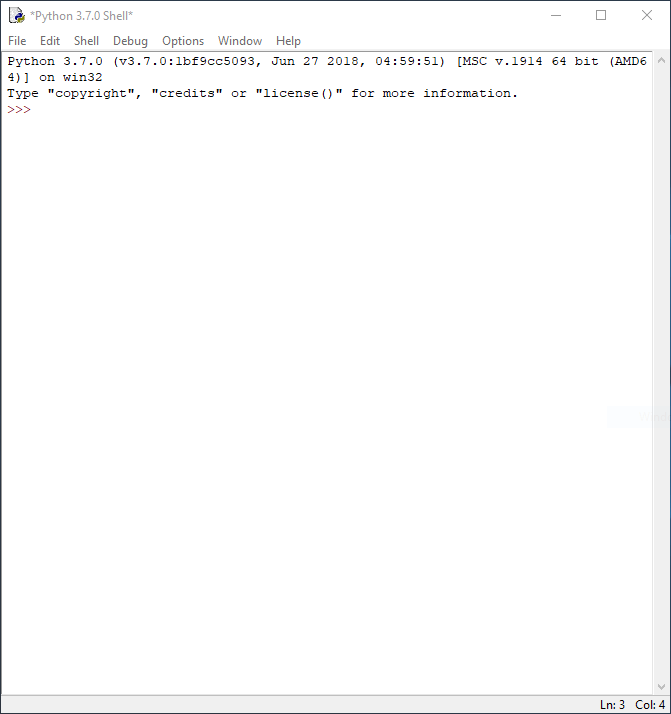
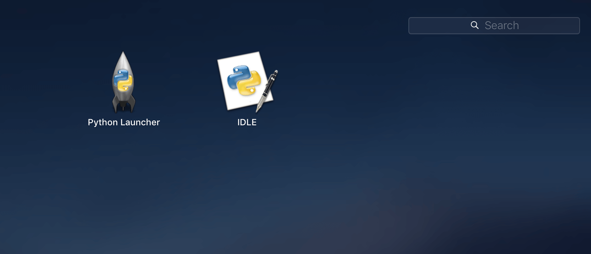

# Getting Started

## Goals
In this guide, we'll get our computer set up to run Python.

We'll split this guide into separate sections for *Windows* and *macOS*, then come back together to write our first Python program on a computer.

## Windows
These instructions are for *Windows* users.

First, head over to [python.org](https://python.org) and hover over the **Downloads** button in the menu:


Let's download the latest Python verison by clicking the gray **Python 3.7.1** button (your version number will be different as new versions are regularly released).


Make sure you select **Add Python 3.7 to PATH**, then click on **Install Now**.

After the install is complete, Python should now be in your **Start Menu**!


Click on **IDLE (Python 3.7)** and this program should appear:



Congratulations, you've successfully installed Python on your Windows machine.

Skip ahead to *The shell* section, and we'll write our first program!

## macOS
These instructions are for *macOS* users.

First, head over to [python.org](https://python.org) and hover over the **Downloads** button in the menu:


Let's download the latest Python by clicking the gray **Python 3.7.1** button (your version number will be different as new versions are regularly released).


Keep the default options selected and click ahead.

After the install is complete, Python should now be in your **Launchpad** (or press *Command + Space* on your keyboard then search for IDLE)!



Click on **IDLE** in the **Launchpad** and this program should appear:


Woo-hoo! We've got Python installed on a Mac. Skip ahead to *The shell* section, and we'll write our first program!

## Web
Are you using a computer on which you cannot install software?

Visit [Repl.it](https://repl.it/languages/python3) for Python 3, a free website which runs Python in the browser.

Here's what you should see:


The right side of the screen (with the black background) is called *The shell* and we'll learn about it next.

The left side of the screen (with the white background) is called *The editor* and we'll also see this soon!

## The shell
Ok, we now have Python installed!

After opening *IDLE*, in the **shell** window type in this: `print('hello world')`, then hit *enter*.


You should notice that `hello world` is printed.

Now try out these:
- `2 * 3`
- `len('hello')`


## First project
The **shell** is great for trying out one line of Python code!

When we need to write longer Python programs, we should create a **separate file**. The good news is that Python IDLE includes a code editor.

With **Python IDLE** open, click on *File > New File*.

In the code editor that opens, paste in this code:

```python
print('If you reading this,')
print('I have written two lines of code that work')
```

Make sure your editor looks like mine below, then click on *Run > Run Module*:


You'll be asked to save the code in the **editor** (right window in image) somewhere on your computer, then you should see the results in the **shell** (left window in image): 


## Your turn
Experiment with changing the code in the editor with any code you've seen in the lessons!

For example, write this code snippet in the **editor**, then run and observe the results in the **shell** window:

```python
coins = 100
coins_behind_sofa = 25

print(coins + coins_behind_sofa)
```

Before finishing this guide make sure you're comfortable with:
- opening **IDLE**
- creating and saving a new Python file
- running the Python file using *Run > Run Module*
- editing Python code in the **editor**
- using the **shell** to experiment with single lines of Python code