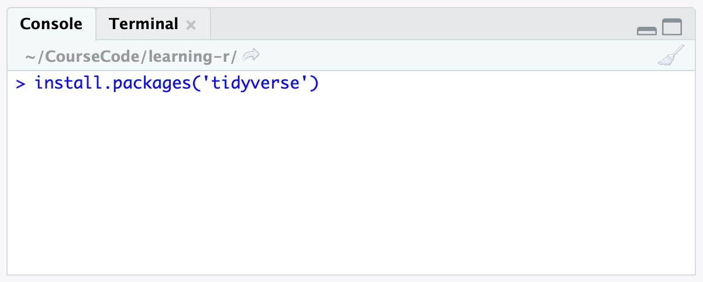
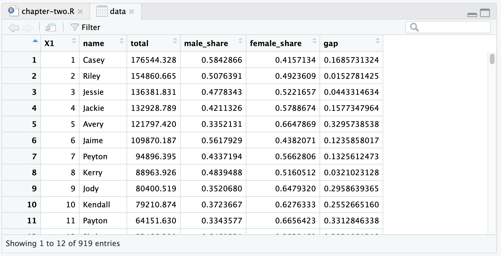
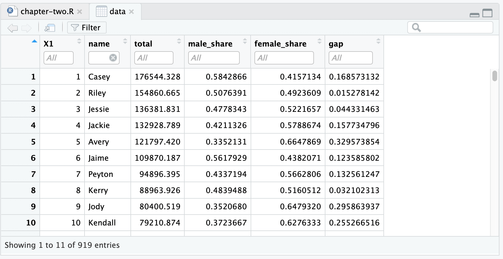
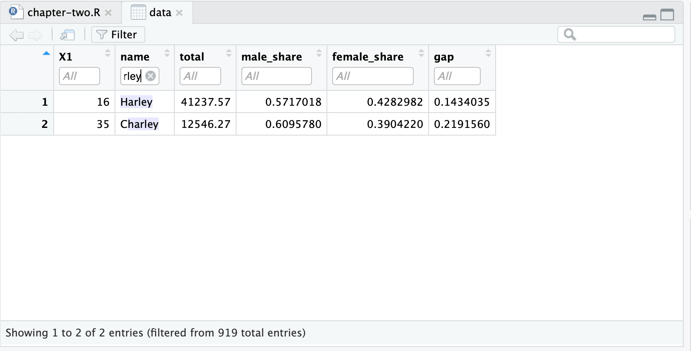

# Exercises

## Installing packages
Install packages by opening RStudio.

In the **console** panel, type in `install.packages('tidyverse')`. This is what your console will look like:



Press *Enter* on your keyboard.

It can take a while to install `tidyverse`, as it is a package that itself contains other big packages.

## Using packages
Create a new R script for this chapter, and inside this file type in:

```r
library(tidyverse)
```

As you saw in the app, this loads the `tidyverse` package.

## Exercises

1. On a piece of paper, write code equivalent to `a %>% b()` that **does not** use the pipe operator.
2. On a piece of paper, write code equivalent to `mean(abs(c(-1, 2)))` into code that **does** use the pipe operator (`%>%`). 

Let's try using the [free datasets from FiveThirtyEight](https://data.fivethirtyeight.com/), a data journalism website.

1. Download any dataset that interests you from [data.fivethirtyeight.com](https://data.fivethirtyeight.com/)
2. Unzip the downloaded file, and copy the `csv` file into your the directory of your R project
3. Use `read_csv` to read in the CSV
4. Store the read CSV into an object called `data`
5. Inspect the head and tail of the object
6. Try running `View(data)`. What happens?
7. Access a specific column of the data using `$`
8. Summarize the data
9. Try at least one other R function from the app

## Exercises (solutions)

For the pipe operator exercises:

1. `b(a)`
2. `c(-1, 2) %>% abs() %>% mean()`

Now, onto the FiveThirtyEight data. I downloaded the The Most Common Unisex Names In America: Is Yours One Of Them? dataset, which includes this [CSV file](https://raw.githubusercontent.com/fivethirtyeight/data/master/unisex-names/unisex_names_table.csv).

The head of the data had this:

```
# A tibble: 6 x 6
     X1 name     total male_share female_share    gap
  <dbl> <chr>    <dbl>      <dbl>        <dbl>  <dbl>
1     1 Casey  176544.      0.584        0.416 0.169 
2     2 Riley  154861.      0.508        0.492 0.0153
3     3 Jessie 136382.      0.478        0.522 0.0443
4     4 Jackie 132929.      0.421        0.579 0.158 
5     5 Avery  121797.      0.335        0.665 0.330 
6     6 Jaime  109870.      0.562        0.438 0.124 
```

The tail of the data was this:

```
# A tibble: 6 x 6
     X1 name     total male_share female_share    gap
  <dbl> <chr>    <dbl>      <dbl>        <dbl>  <dbl>
1   914 Olayinka  103.      0.418        0.582 0.163 
2   915 Eaden     102.      0.573        0.427 0.146 
3   916 Inioluwa  101.      0.353        0.647 0.295 
4   917 Gwin      101.      0.562        0.438 0.124 
5   918 Yacine    100.      0.545        0.455 0.0892
6   919 Aeon      100.      0.465        0.535 0.0703
```

Here's the entire script:

```r
library(tidyverse)
data <- read_csv('unisex_names_table.csv')
head(data)
tail(data)
View(data)
# Access a specific column
data$name
summary(data)
```
 
Something new is the `View` function that's a spreadsheet-like view of a tibble.

Here's what my dataset look like, yours will no doubt look different (unless we chose the same data 😎):


Here's a neat feature. Try clicking on the filter button from your view screen:


You can now set a filter on the values and you can also click on the columns to sort them:



## Data licenses
The `fivethirtyeight` R package is licensed under the MIT license.

The FiveThirtyEight data is licensed and used under CC-BY via [https://github.com/fivethirtyeight/data](https://github.com/fivethirtyeight/data). See [https://github.com/fivethirtyeight/data/blob/master/LICENSE](https://github.com/fivethirtyeight/data/blob/master/LICENSE) for license details.