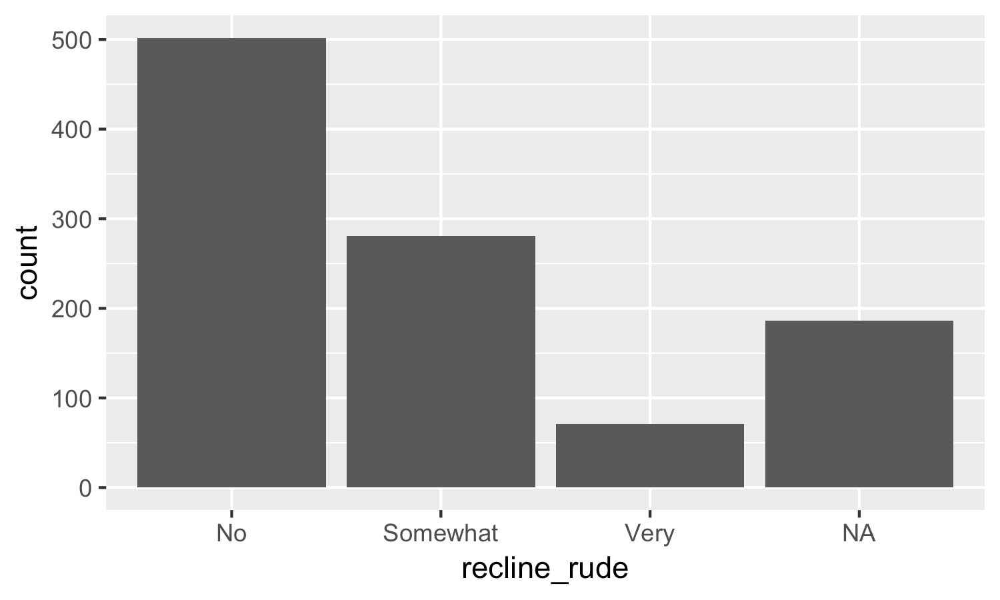
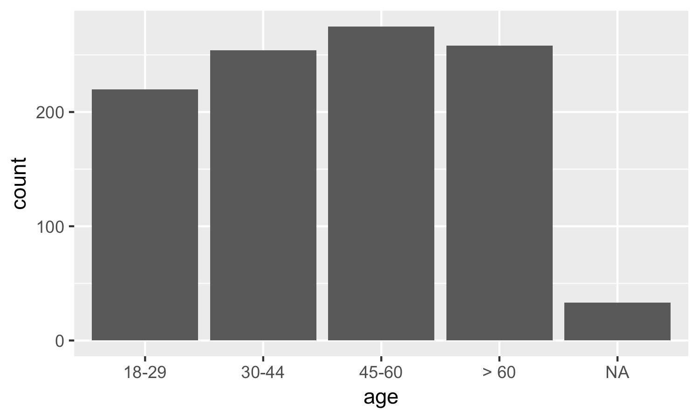
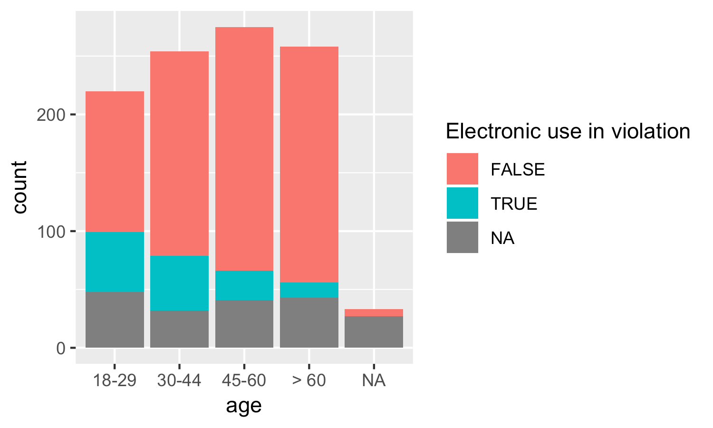

# Exercises

## Exercises

We're using the `flying` dataset from the `fivethirtyeight` package.

Load in the `tidyverse` and `fivethirtyeight` packages, then try to recreate the following graphs using `ggplot2` code.

**Recreate this graph:**


Use this code to get started (add the required `aes` arguments):

```r
ggplot(flying, aes()) +
  geom_bar()
```

**Recreate this graph:**


**Recreate this graph:**


*Tip*: Make sure you consider the legend label fill. It shows the fill for "Electronic use in violation".

If you're unsure of the column required, try running `colnames(flying)` or `help(flying)`.

**Recreate this graph:**


*Tip*: What will you facet by?

## Exercises (solution)

Here's the solution code to create each graph shown:

```r
library(tidyverse)
library(fivethirtyeight)
help(flying)

ggplot(flying, aes(x = recline_rude)) +
  geom_bar()

ggplot(flying, aes(x = age)) +
  geom_bar()

ggplot(flying, aes(x = age, fill = electronics)) +
  labs(fill = "Electronic use in violation") +
  geom_bar()

ggplot(flying, aes(x = recline_rude)) +
  geom_bar() +
  labs(x = "Is it rude to recline your seat on a plane?") +
  facet_wrap(~ recline_frequency) + 
  theme(axis.text.x = element_text(angle = 90, vjust = 0.5))
```

## Data licenses
The `fivethirtyeight` R package is licensed under the MIT license.

The FiveThirtyEight data is licensed and used under CC-BY via [https://github.com/fivethirtyeight/data](https://github.com/fivethirtyeight/data). See [https://github.com/fivethirtyeight/data/blob/master/LICENSE](https://github.com/fivethirtyeight/data/blob/master/LICENSE) for license details.