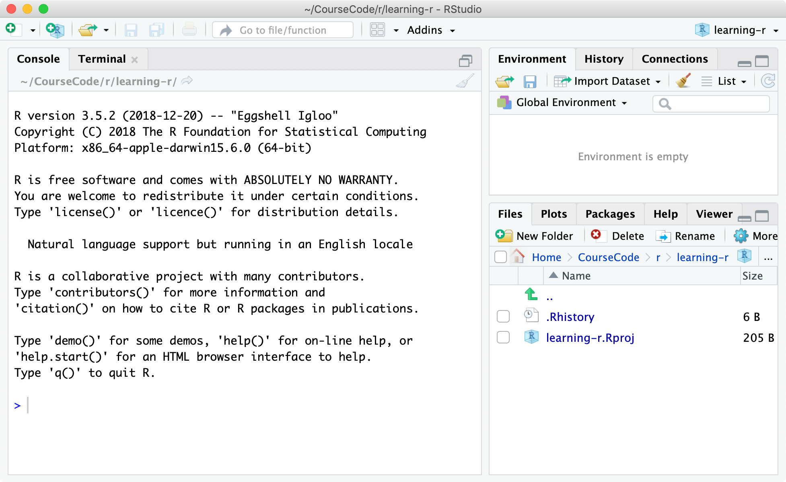
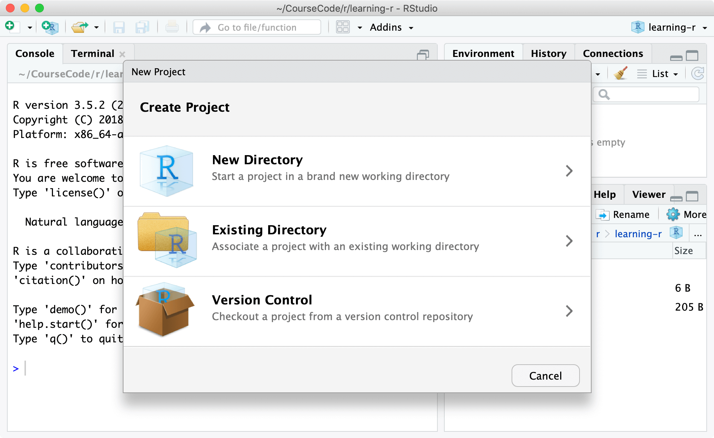
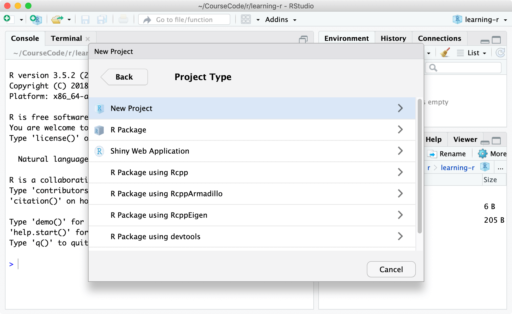
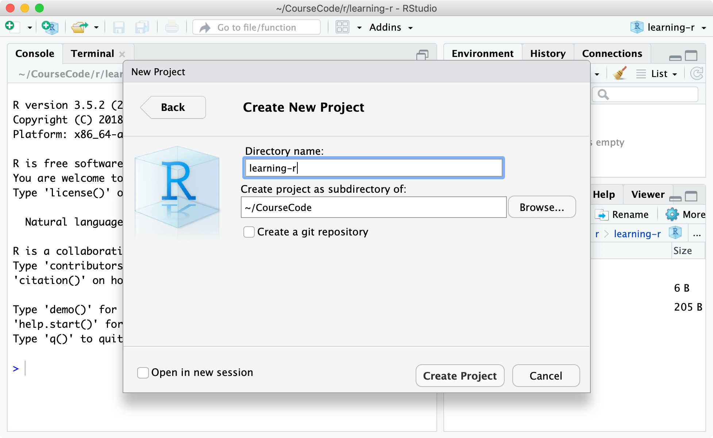
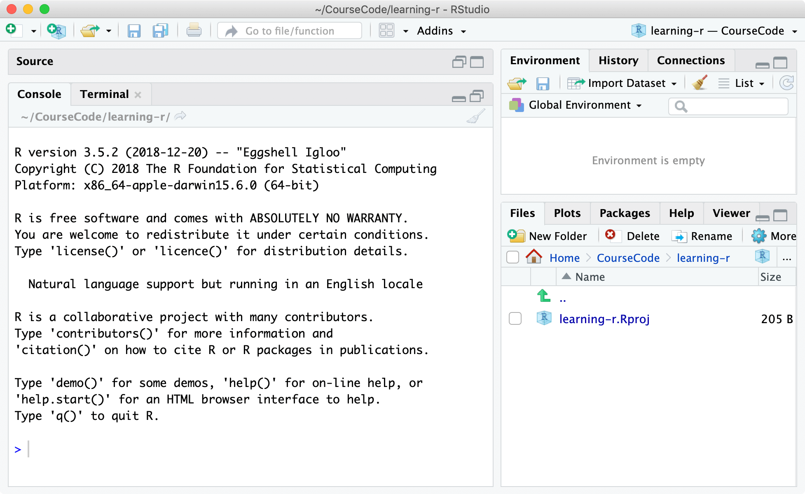
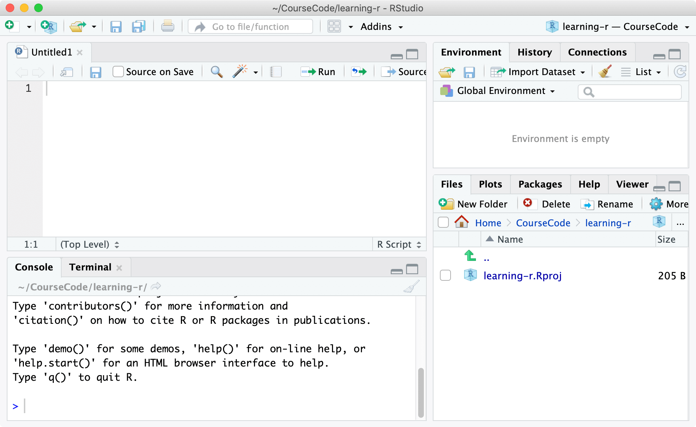
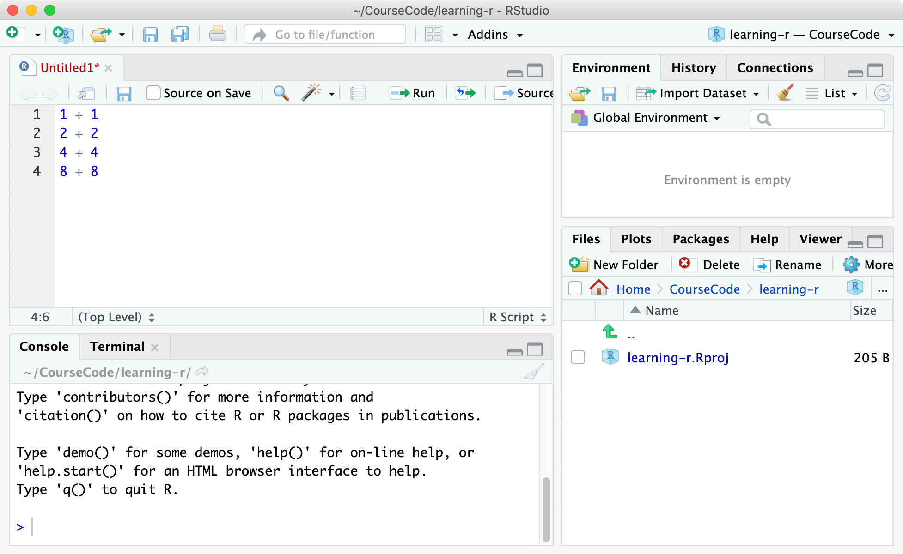
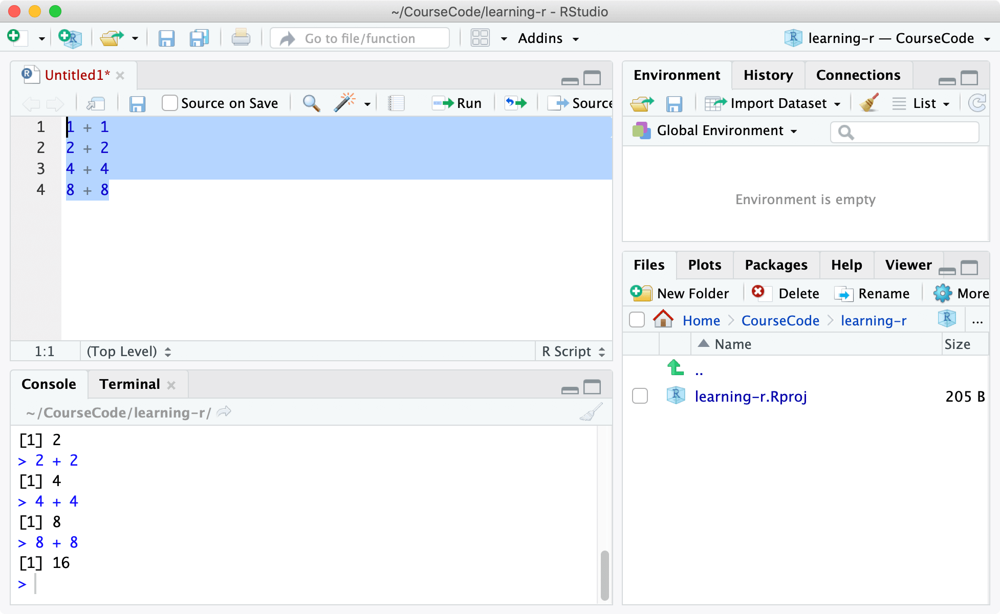
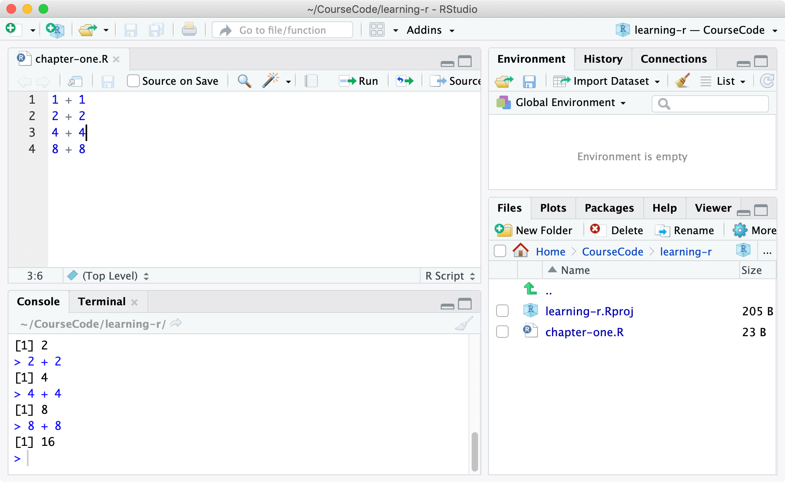
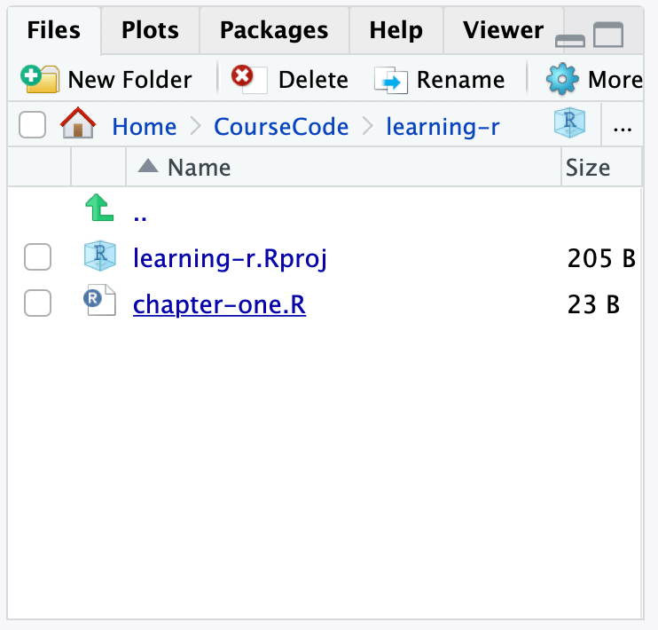

# Using R and RStudio Guide

## Welcome
Let's start using R and RStudio on a computer!

While R is a programming language, RStudio is an integrated development environment (IDE), which is a fancy way to say that it's a piece of software where you can author R code, with helpful features like code autocompletion and syntax highlighting (coloring the code).

### Installing R
To install R:

1. Select a link in the country closest to you from [https://cran.r-project.org/mirrors.html](https://cran.r-project.org/mirrors.html) (R downloads are hosted on many servers worldwide, especially on university and government servers) or just visit [https://mirror.aarnet.edu.au/pub/CRAN/](https://mirror.aarnet.edu.au/pub/CRAN/)
2. Select **Download R for (Mac) OS X**  or **Download R for Windows** depending on your operating system
3. Install the downloaded package

Note if you're using Linux, you might already have R installed.

### Install RStudio
Now that you have installed R, let's install RStudio.

This software will help in writing R code.

To install RStudio:
1. Visit [rstudio.com/products/rstudio/download/](https://www.rstudio.com/products/rstudio/download/)
2. Select RStudio Desktop - Open Source License
3. Install RStudio Desktop

### Opening RStudio
Open RStudio and you should see this:



Let's make a project to organize all the code you'll be writing.



Click on **File** > **New project**.



Select **New Project**.



Set the directory to where you'd like to store your code. I'm calling my directory, 'learning-r'.

### Writing code


Here's what the empty project looks like. You're able to type R code into the Console shown. Try typing `2 + 2`, then using the *Enter* key. 


Expand the source window, if it is not already opened, by clicking on the expand icon.

Your window should look like my screen above.



You can write multiple lines of R code. Try typing in this R code into the source screen:

```r
1 + 1
2 + 2
4 + 4
8 + 8
```

### Running code


To actually run your code, you can highlight the lines you want to run, then click on the run button.

Notice the console will be updated with the results from your code.

### Saving code

Save your code for later into a file using File > Save as. Name this file `chapter-one.R`.

This file is commonly known as a **script**.

You should notice that the name in the tab has changed from *Untitled 1* to *chapter-one.R*.



You'll also notice the files panel has your new script.

Double-check your file is created by opening Windows Explorer (on Windows) or Finder (on Mac) to check that your directory has your saved code.