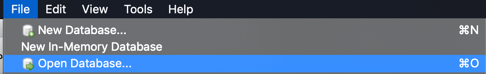

# Exercises

## Exercises
This dataset is "2013 On Track - Individual Year 12 Student Completers", which is a survey run in Victoria that contains post-school destinations of those that finished school.

I've already imported the CSV file into a SQL database. To use this database open the **on_track_survey.db** file from [https://github.com/projectmaterial/sql-data/archive/master.zip](https://github.com/projectmaterial/sql-data/archive/master.zip).

To open a database, use *File > Open database* in DB Browser for SQLite:



Run this query to verify you've correctly opened the file:

```sql
SELECT *
FROM on_track_survey;
```

Complete these exercises using just the `on_track_survey` table:

1. `lote_status` contains `1` when a language other than English is spoken at home and `0` otherwise, find the average of the `lote_status` column
2. Find the number of people who speak a language other than English at home
3. Find the number of people who **do not** speak a language other than English at home
4. Find the maximum student id (`student_id`) in the database
5. Find `local_government_area` and `destination` of the student with a `student_id` of `39`
6. Count the values in the `sex` column
7. Group by `sex` and use `COUNT` to find the count of each `sex` in the survey
8. Group by `country_of_birth` and use `COUNT` to find the count of each country of birth in the survey, order by the count
9. Group by `education_sector` and use COUNT to find the count of each `education_sector` in the survey, order by the count
10. Group by `education_sector` **and** `area` and use `COUNT` to find the count of each `education_sector` and `area` in the survey, order by the count

## Solutions

```sql
-- lote_status contains 1 when a language other than English is spoken at home and 0 otherwise, find the average of the lote_status column
SELECT AVG(lote_status)
FROM on_track_survey;

-- Find the number of people who speak a language other than English at home
SELECT COUNT(*)
FROM on_track_survey
WHERE lote_status = 1;

-- Find the number of people who do not speak a language other than English at home
SELECT COUNT(*)
FROM on_track_survey
WHERE lote_status = 0;

-- Find the maximum student id (student_id) in the database
SELECT MAX(student_id)
FROM on_track_survey;

-- Find local_government_area and destination of the student with a student_id of 39
SELECT local_government_area, destination
FROM on_track_survey
WHERE student_id = 39;

-- Count the values in the sex column
SELECT COUNT(sex)
FROM on_track_survey;

-- Group by sex and use COUNT to find the count of each sex in the survey
SELECT COUNT(*), sex
FROM on_track_survey
GROUP BY sex;

-- Group by country_of_birth and use COUNT to find the count of each country of birth in the survey, order by the count
SELECT COUNT(*), country_of_birth
FROM on_track_survey
GROUP BY country_of_birth
ORDER BY COUNT(*) DESC;

-- Group by education_sector and use COUNT to find the count of each education_sector in the survey, order by the count
SELECT COUNT(*), education_sector
FROM on_track_survey
GROUP BY education_sector
ORDER BY COUNT(*) DESC;

-- Group by education_sector and area and use COUNT to find the count of each education_sector and area in the survey, order by the count
SELECT COUNT(*), education_sector, area
FROM on_track_survey
GROUP BY education_sector, area
ORDER BY COUNT(*) DESC;
```

## Data licenses
"2013 On Track - Individual Year 12 Student Completers" (dv164-ontrackyear12orequivcompleters2013.csv and on_track_survey.db)
Original file downloaded from [https://discover.data.vic.gov.au/dataset/2013-on-track-individual-year-12-student-completers](https://discover.data.vic.gov.au/dataset/2013-on-track-individual-year-12-student-completers). Data is licensed under [Creative Commons Attribution 4.0 International](https://creativecommons.org/licenses/by/4.0/) by Department of Education and Training (State Government of Victoria).