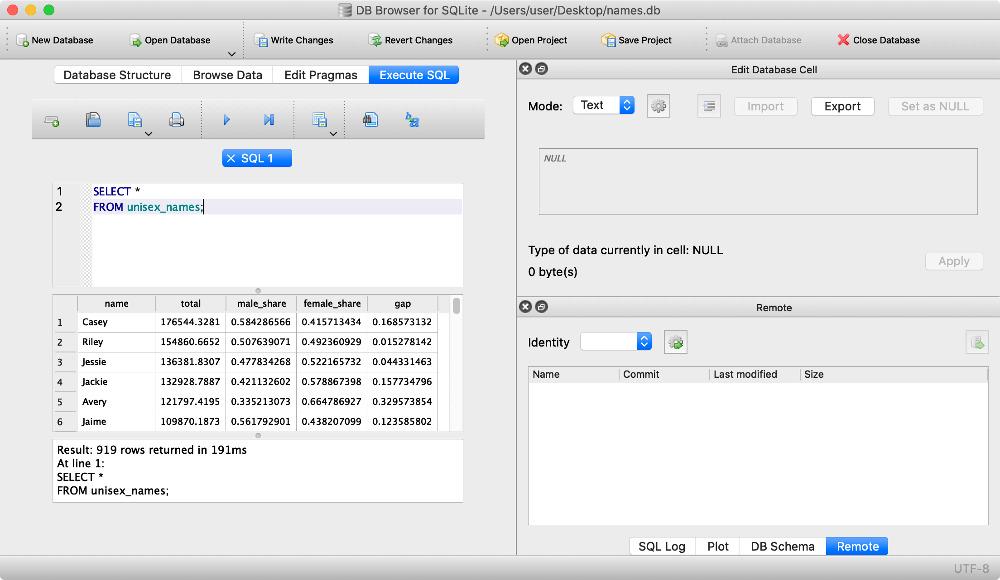

# Using SQL Guide

## Step 1: Getting DB Browser for SQLite ready
Let's learn how to **import data** and **query SQL databases** on your computer.

To start off, download and install [DB Browser for SQLite](https://sqlitebrowser.org/), this free software lets you create and edit SQL databases which are compatible with SQLite.

Once installed, open up the program. It should look something like this:


You're now ready to create a new database! Click the *New database* icon, then save it somewhere:


You'll be presented with a screen to create a new table. Click *cancel*:


## Step 2: Importing Data
We now want to import some data, so we can run SQL queries!

Download and extract the ZIP file at [https://github.com/projectmaterial/sql-data/archive/master.zip](https://github.com/projectmaterial/sql-data/archive/master.zip) (just double click to extract on a Mac, or right-click the file then select *Extract All* on Windows). The extracted folder contains all the data we'll need for the exercises you'll be completing here!

Now, inside DB Browser for SQLite, make sure you have your new database (from before) ready! Click on *File > Import > Table from CSV file ...* and select *unisex_names_table.csv* from your extracted ZIP file:


We can now set-up our import. Give the table a name of *unisex_names*, set the field separator to *,* and make sure *Column names in first line* is selected like this:


Click on *OK* to import the data from the CSV into your SQL database.

Let's check that everything has worked out! Click on *Execute SQL* and type in this SQL code which selects all rows and columns from your new table then run your code by clicking the *Execute* button (which has a play button icon) or using the *F5* keyboard shortcut:

```sql
SELECT *
FROM unisex_names;
```



You should see your imported table appear! You now know how to create your own databases, and import data into your database from a CSV file!